# Kế Hoạch Hiện Thực Hóa: Tích Hợp Master Process Hub Vào Dashboard Dùng Chung Cho Mọi Dự Án

## 1. Bối Cảnh & Mục Tiêu

### 1.1. Bối Cảnh
Hiện tại, dự án Automation Hub (`D:\_Automation-Project`) và các dự án vệ tinh (`D:\_SieuVietGroup`, `D:\_CarThings\Automation_Carthings`) kết nối với **Master Process Hub** (`D:\_Master_Process`) chủ yếu qua dòng lệnh thủ công (`master.py`, PowerShell scripts). Việc ghim phiên bản (Process Lock), kiểm tra độ lệch (Drift Detection), quét chất lượng module & secret (Modularity & Secret Audit), cũng như quản trị Git Hooks đang phụ thuộc vào thao tác gõ terminal của từng kỹ sư, chưa có giao diện trực quan và cơ chế kiểm soát tập trung trên Dashboard.

### 1.2. Mục Tiêu
Xây dựng module **Master Process Integration** trực tiếp vào **Dashboard Core** (`dashboard/`):
1. **Dùng chung cho toàn bộ dự án**: Khi cập nhật tại Hub, cơ chế `sync-satellites.js` sẽ tự động phân phối tính năng này sang tất cả các dự án con (`_SieuVietGroup`, `_CarThings`, v.v.).
2. **Quản trị 1-Click trên Web UI**: 
   - Giám sát trạng thái Anti-Drift: hiển thị commit SHA, phiên bản Hub, trạng thái `IN_SYNC` vs `DRIFT_DETECTED` vs `UNPINNED`.
   - Nút hành động 1-click: Ghim phiên bản (`Init`), Đồng bộ template (`Sync`), Cài đặt / Bảo trì Git Hook (`Install Hooks`), Quét mã nguồn & bí mật (`Audit`).
   - Bảng hiển thị kết quả kiểm định trực tiếp (Logs, Violations, Exemptions).
3. **Chuẩn hóa CLI trong `package.json`**: Cung cấp đầy đủ bộ phím tắt `mp:*` đồng bộ giữa Dashboard UI và CLI terminal.
4. **Bảo vệ toàn diện (Fail-Safe)**: Pre-commit hook chặn đứng mọi hành vi commit file vượt giới hạn số dòng hoặc chứa Secret (API Key / AWS Token).

---

## 2. Kiến Trúc Giải Pháp

```mermaid
graph TD
    subgraph MasterProcessHub [D:/_Master_Process]
        MP_CLI[master.py CLI]
        MP_SCRIPTS[scripts/ modularity_audit.py, project_manager.py, audit-probes.ps1]
        MP_TEMPLATES[templates/ .ai, hooks/pre-commit]
    end

    subgraph DashboardEngine [Dashboard Core - D:/_Automation-Project/dashboard]
        MP_Service[services/masterProcessService.js]
        MP_Routes[routes/masterProcessRoutes.js]
        MP_UI[templates/settings.html - Subtab Master Process]
        MP_Slice[public/js/views/settings/settingsSlice.js]
    end

    subgraph Satellites [Các Dự Án Con]
        SVG[D:/_SieuVietGroup]
        CT[D:/_CarThings/Automation_Carthings]
    end

    MP_CLI --> MP_Service
    MP_Service --> MP_Routes
    MP_Routes --> MP_Slice
    MP_Slice --> MP_UI
    DashboardEngine -->|sync-satellites.js| SVG
    DashboardEngine -->|sync-satellites.js| CT
```



---

## 3. Thiết Kế Chi Tiết

### 3.1. Backend API & Services

#### File Má»›i: `dashboard/services/masterProcessService.js`
Đảm nhiệm giao tiếp với Master Process Engine qua Python subprocess an toàn:
- **Nguyên tắc an toàn (Security & Reliability):**
  - **Chống Command Injection:** Bắt buộc sử dụng `child_process.execFile` hoặc `child_process.spawn` với mảng tham số rời (`args`), tuyệt đối không dùng `exec(string)`. Hỗ trợ đường dẫn Windows có khoảng trắng.
  - **Kiểm soát Path Traversal:** Hàm `validateProjectPath(projectRoot)` chỉ cho phép thực thi trên các thư mục thuộc danh sách dự án hợp lệ (như `D:\_Automation-Project`, `D:\_SieuVietGroup`, `D:\_CarThings...`), từ chối các đường dẫn ngoài phạm vi.
  - **Timeout chống treo:** Cấu hình `timeout: 60000` (60 giây) cho các lệnh quét sâu (`doctor`, `audit`, `probes`).
- `detectMasterProcessPath(projectRoot)`: Tìm đường dẫn Master Process Hub (qua biến môi trường `MASTER_PROCESS_ROOT`, cấu hình `.ai/process-lock.json`, hoặc đường dẫn mặc định chuẩn `D:/_Master_Process`).
- `getProjectStatus(projectRoot)`:
  - Đọc `.ai/process-lock.json` -> Trích xuất `version`, `hub_commit`, `installed_at`.
  - Gọi `python master.py check-drift <target>` -> Lấy trạng thái đồng bộ (`IN_SYNC` / `DRIFT_DETECTED` / `UNPINNED`).
  - Kiểm tra trạng thái Git Hook tại `.git/hooks/pre-commit` (Đã cài Managed V2 hay chưa).
  - Trả về tổng quan JSON cho Dashboard.
- `initProject(projectRoot)`: Chạy `python master.py init <target>`.
- `syncProject(projectRoot, options)`: Chạy `python master.py sync <target>` (hỗ trợ cờ `--dry-run` xem trước và `--update-templates` để ghi đè an toàn có sao lưu `.bak`).
- `installHooks(projectRoot)`: Chạy `python master.py install-hooks <target>`.
- `runAudit(projectRoot, staged)`: Chạy `python master.py audit <target>` (phân tích số file quét, violations, exemptions, secret leaks).
- `runDoctor(projectRoot)`: Chạy `python master.py doctor <target>`.
- `runProbes(projectRoot, probeId)`: Chạy PowerShell audit-probes nếu cần.

#### File Má»›i: `dashboard/routes/masterProcessRoutes.js`
Đăng ký các RESTful endpoints:
- `GET  /api/mp/status`: Trả về thông tin kết nối, lock info, drift status, hook status.
- `POST /api/mp/init`: Thực hiện ghim phiên bản.
- `POST /api/mp/sync`: Đồng bộ templates và refresh lock.
- `POST /api/mp/install-hooks`: Cài đặt / cập nhật Git pre-commit hook.
- `POST /api/mp/audit`: Chạy quét modularity và secret scanning.
- `POST /api/mp/doctor`: Kiểm tra sức khỏe toàn diện dự án.
- `POST /api/mp/probes`: Chạy kiểm tra các probes P1-P6.

#### Cập nhật: `dashboard/routes.js`
Đăng ký `handleMasterProcessRoutes(request, response, url, root)` vào router chính của Dashboard.

---

### 3.2. Frontend Dashboard UI/UX

#### Cập nhật Template: `dashboard/public/templates/settings.html`
Thêm subtab mới vào thanh điều hướng Settings:
```html
<button class="settings-subtab" type="button" role="tab" data-subtab="master-process">
  <i class="ph-bold ph-shield-check"></i> Quy trình Master Process
</button>
```
Thêm panel nội dung `#settings-master-process`:
1. **Thẻ Anti-Drift & Process Lock**:
   - Hiển thị: Master Path, Hub Version, Hub Commit SHA, Trạng thái (`IN_SYNC` 🟢 / `DRIFT_DETECTED` 🔴 / `UNPINNED` ⚪).
   - Nút bấm: `[ 📌 Ghim phiên bản (Init) ]`, `[ 🔍 Kiểm tra Drift ]`.
   - **Luồng Đồng Bộ An Toàn (Sync 2 Nấc):**
     - Mặc định bấm `[ 🔄 Xem trước Đồng bộ (--dry-run) ]`: Chạy chế độ xem trước, in danh sách file sẽ thay đổi mà không ghi đè.
     - Checkbox xác nhận: `[ ] Cho phép ghi đè templates có sao lưu (.bak) (--update-templates)`. Khi tích chọn, nút đổi sang màu cam `[ ⚠️ Xác nhận Đồng bộ & Ghi đè ]`.
2. **Thẻ Git Pre-commit Hook**:
   - Hiển thị: Trạng thái cài đặt (`Đã kích hoạt Managed V2` 🟢 / `Chưa cài đặt` 🔴 / `Trỏ Hub hợp lệ`).
   - Nút bấm: `[ 🛡️ Cài đặt / Khắc phục Hook ]`.
3. **Thẻ Kiểm Định Modularity & Secret Audit**:
   - Hiển thị chỉ số: Tổng số file mã nguồn, Số lỗi vi phạm kích thước (Violations), Số file miễn trừ (Exemptions).
   - Nút bấm: `[ ⚡ Quét toàn bộ mã nguồn ]`, `[ ⚡ Quét Staged Git Files ]`, `[ 🩺 Doctor Kiểm tra Toàn diện ]`.
4. **Bảng Điều Khiển Console / Output**:
   - Vùng terminal hiển thị log chi tiết khi chạy Audit / Probes / Sync với font `JetBrains Mono`.

#### Cập nhật Logic: `dashboard/public/js/views/settings/settingsSlice.js`
- Xử lý nạp dữ liệu trạng thái `/api/mp/status` khi chuyển sang tab `master-process`.
- **Quản lý trạng thái thực thi (Execution Lock & Loading State):**
  - Khi một tiến trình đang chạy: Vô hiệu hóa (disable) toàn bộ các nút bấm trong panel, hiển thị spinner xoay và nhãn trạng thái "Đang thực thi...".
  - Ngăn chặn người dùng bấm nhiều lần gây nghẽn tiến trình nền.
- Cập nhật badge trạng thái và in output ra console panel trực quan.
- Tuân thủ quy tắc bất biến: **100% DOM APIs, không dùng `innerHTML` cho dữ liệu server**.

#### Cập nhật CSS: `dashboard/public/styles/views/settings.css`
- Thiết kế badge trạng thái đồng bộ, card hiển thị thông số và output viewer chuẩn Dark/Light mode.

---

### 3.3. Tích Hợp CLI Vào `package.json`

Cập nhật `package.json` của Hub (`D:\_Automation-Project`) để khi chạy `sync-satellites.js`, mọi vệ tinh đều có sẵn bộ lệnh:
```json
"scripts": {
  "mp:doctor": "python D:/_Master_Process/master.py doctor .",
  "mp:audit": "python D:/_Master_Process/master.py audit .",
  "mp:optimize": "python D:/_Master_Process/master.py optimize .",
  "mp:candidates": "python D:/_Master_Process/master.py candidates .",
  "mp:audit-deps": "python D:/_Master_Process/master.py audit-deps .",
  "mp:probes": "powershell -NoProfile -ExecutionPolicy Bypass -File D:/_Master_Process/scripts/audit-probes.ps1 -ProbeId ALL .",
  "mp:drift": "python D:/_Master_Process/master.py check-drift .",
  "mp:sync": "python D:/_Master_Process/master.py sync .",
  "mp:gate": "python D:/_Master_Process/master.py gate .",
  "mp:evidence": "python D:/_Master_Process/master.py generate-evidence"
}
```

---

## 4. Kế Hoạch Thực Hiện (Phases)

| Phase | Nội dung thực hiện | Bằng chứng / Deliverables |
|---|---|---|
| **Phase 1** | Xây dựng Backend Service & API Routes (`masterProcessService.js`, `masterProcessRoutes.js`, unit test). Tích hợp Path Whitelist Validation & Timeout 60s. | Chạy unit test backend passed 100%, API trả về JSON đúng chuẩn, chặn an toàn path lạ. |
| **Phase 2** | Xây dựng Giao diện Dashboard (Template `settings.html`, Subtab Master Process, Sync 2 nấc, `settingsSlice.js`, CSS). | UI render mượt mà, bấm nút gọi API, hiển thị loading state và kết quả đúng chuẩn. |
| **Phase 3** | Cập nhật Whitelist trong `sync-satellites.js`, cập nhật `package.json` & Đồng bộ sang vệ tinh `_SieuVietGroup`. | Vệ tinh nhận đủ module Dashboard và scripts `mp:*` mà không bị sót file. |
| **Phase 4** | Nghiệm thu toàn diện trên trình duyệt và CLI vệ tinh: Kiểm tra Drift, Audit 0 violations, Hook chặn Secret, Test Sync 2 nấc an toàn. | Chụp ảnh UI Dashboard, log terminal `IN_SYNC`, test leak chặn thành công. |

---

## 5. Tiêu Chí Nghiệm Thu (Acceptance Criteria)

1. **Dashboard UI:**
   - Mở `http://127.0.0.1:4180/#/settings` -> Chuyển sang subtab **Quy trình Master Process**.
   - Thẻ Anti-Drift hiển thị trạng thái `IN_SYNC` (màu xanh lục).
   - Thẻ Git Hook hiển thị `Đã kích hoạt (Managed V2)`.
   - Bấm nút **Quét Modularity & Secret**: Quét 200+ file, trả về `violations=0`, hiển thị danh sách file miễn trừ rõ ràng.
   - Thử bấm **Xem trước Đồng bộ (--dry-run)** khi chưa tích checkbox: Hiển thị preview các thay đổi trên console mà không đụng chạm đến file nguồn của dự án con.
   - Khi API đang thực thi: Toàn bộ nút hành động bị disable và hiển thị spinner trạng thái.
2. **CLI Terminal tại `D:\_SieuVietGroup`:**
   - `npm run mp:drift` -> `Hub Sync Status: IN_SYNC` (exit code 0).
   - `npm run mp:audit` -> `violations=0` (exit code 0).
3. **Bảo mật & Phòng vệ An Toàn:**
   - Thử gửi request API với đường dẫn mục tiêu ngoài whitelist (ví dụ `C:\Windows`) -> API trả về lỗi 400/403 Bad Request, không thực thi command.
   - **Pre-commit Hook chặn rò rỉ bí mật:**
     - Tạo file `test_leak.py` chứa `AWS_KEY = "AKIA1234567890ABCDEF"`.
     - Thử `git add test_leak.py` và `git commit` -> Hook lập tức huỷ commit và in thông điệp `SECRET VIOLATION: test_leak.py:1 contains possible secret (AWS Access Key)`.
     - Dọn dẹp sạch file test sau khi xác minh.
