# Kế Hoạch Hiện Thực Hóa: Cầu Nối Acceptance Gate 4 & Circuit Breaker Đóng Băng Tính Năng

> **Mã kế hoạch:** `PLAN-13`  
> **Trạng thái:** `COMPLETED (Đã Hoàn Tất & Kiểm Định Nghiệm Thu)`  
> **Tài liệu tham chiếu:** [03_ACCEPTANCE_GATES.md](file:///D:/_Master_Process/03_ACCEPTANCE_GATES.md), [04_PROJECT_AUDIT_STANDARD.md](file:///D:/_Master_Process/04_PROJECT_AUDIT_STANDARD.md), [12_MASTER_PROCESS_DASHBOARD_INTEGRATION_PLAN.md](file:///d:/_Automation-Project/_Plan_implement/12_MASTER_PROCESS_DASHBOARD_INTEGRATION_PLAN.md)  
> **Phạm vi áp dụng:** Framework Nền tảng Hub (`D:\_Automation-Project`), Dashboard Core, và các dự án vệ tinh (`D:\_SieuVietGroup`, `D:\_CarThings\Automation_Carthings`).

---

## 1. Bối Cảnh & Mục Tiêu

### 1.1. Bối Cảnh Thực Tế
Hiện tại bộ công cụ kiểm thử Playwright đang chạy độc lập:
1. Kết quả test Playwright chỉ xuất báo cáo HTML/JSON cục bộ (`playwright-report/`), chưa gắn với cơ chế kiểm soát chất lượng chính thức của **Master Process Hub** (Gate 3/4). Hub sở hữu công cụ gác cổng bất biến (`generate-gate-evidence.py` và `review-gate.py`) yêu cầu `junit.xml`, `contract.json` và mã băm SHA256 chống gian lận.
2. Khi bộ test suite gặp lỗi P0 nghiêm trọng (vỡ luồng nộp CV/thanh toán, flaky test hệ thống, rò rỉ bảo mật), dự án chưa có cơ chế cứng để đóng băng quy trình phát hành (**Feature Freeze Circuit Breaker**), dẫn tới nguy cơ merge code lỗi hoặc test lọt lưới.
3. Sổ theo dõi nợ kỹ thuật và các phát hiện thẩm định (`audit/FINDINGS_REGISTRY.md`) chưa được thiết lập đồng bộ theo Tiêu Chuẩn Thẩm Định 04.
4. Người dùng yêu cầu **xây dựng dùng chung qua Dashboard** để tất cả các dự án con đều được thừa hưởng tính năng này.

### 1.2. Mục Tiêu Cốt Lõi
1. **Cầu nối JUnit sang Bằng chứng Gate 3 & Gate 4**:
   - Tự động xuất `test-results/junit.xml` chuẩn từ Playwright.
   - Xây dựng `scripts/export-gate-evidence.js` trích xuất assertion thật, tính toán SHA256, liên kết AC/TC, sinh `.gate-artifacts/evidence-gate4.json`.
   - Cung cấp cơ chế ký duyệt độc lập `review:gate4` tuân thủ nghiêm ngặt quy định chống Self-Review.
2. **Bộ Ngắt Mạch Đóng Băng Tính Năng (Circuit Breaker)**:
   - Khởi tạo `audit/FINDINGS_REGISTRY.md` và `audit/FREEZE.json` theo Standard 04.
   - Bảo vệ đa tầng (Defense-in-Depth): Chặn thực thi ngay lập tức ở **CLI Runner** (`run-suite.js`), **Playwright Core Fixture** (`baseTest.js`), và **Dashboard Web Studio Backend** (`runnerRoutes.js`).
3. **Quản trị Tập Trung trên Dashboard Web Studio**:
   - Hiển thị tình trạng Circuit Breaker (Banner cảnh báo trực quan khi FROZEN).
   - Nút thao tác kích hoạt Freeze khẩn cấp hoặc gỡ bỏ (Lift Freeze) có thẩm định quyền hạn.
   - Thẻ theo dõi trạng thái Bằng chứng Nghiệm thu Gate 4.
4. **Phân phối Đồng bộ Không Sai Lệch (Zero-Drift Sync)**:
   - Đồng bộ trơn tru qua `sync-satellites.js` sang `D:\_SieuVietGroup` và `D:\_CarThings`.

---

## 2. Đánh Giá Toàn Diện Các Điểm "Thủng" / Lỗ Hổng Kỹ Thuật (Critical Gap Audit)

Trước khi bắt tay vào hiện thực hóa, kế hoạch đã tiến hành "vạch lá tìm sâu" và phát hiện **8 lỗ hổng tiềm ẩn** nếu chỉ làm theo mô tả sơ bộ ban đầu:

| STT | Điểm Thủng / Lỗ Hổng Tiềm Ẩn | Mức Độ | Hậu Quả Nếu Không Xử Lý | Giải Pháp Trong Kế Hoạch Này |
|:---:|---|:---:|---|---|
| **01** | **Lỗi cú pháp Python Argparse trong lệnh `review:gate4`** | **P0** | Đề bài ghi `--approver @qa-lead`, nhưng `review-gate.py` của Hub bắt buộc `--gate 4 --actor <name> --session <id>`. Chạy lệnh gốc sẽ văng Exception `unrecognized arguments` ngay lập tức. | Tạo wrapper `scripts/review-gate-evidence.js` chuẩn hóa tham số, sinh session ID duy nhất và kiểm tra chống tự ký duyệt (Self-Review Forbidden). |
| **02** | **Dự án vệ tinh (`_SieuVietGroup`) chưa có file `contract.json`** | **P0** | `generate-gate-evidence.py` yêu cầu bắt buộc file hợp đồng. Nếu không tìm thấy, script ném `FileNotFoundError` và dừng toàn bộ CI. | `export-gate-evidence.js` tích hợp cơ chế **Contract Resolver & Auto-Scaffold Fallback**: tự tìm contract ở `requirements/`, `.delivery/`, `.ai/`, hoặc tự sinh contract schema hợp lệ từ các kịch bản test hiện có. |
| **03** | **Lỗ hổng vượt rào Circuit Breaker (Bypass Traps)** | **P0** | Nếu chỉ chặn ở `scripts/run-suite.js`, developer chạy `npx playwright test` trực tiếp hoặc bấm nút "Run" trên Dashboard Web UI sẽ bypass hoàn toàn Circuit Breaker! | Thiết lập **Bảo vệ 3 Tầng**: Tầng 1 (`run-suite.js`), Tầng 2 (`core/fixtures/baseTest.js` - chặn mọi CLI/VSCode), Tầng 3 (`dashboard/routes/runnerRoutes.js` - chặn Web UI). |
| **04** | **Ghi đè cấu hình Playwright Config (`defineQaConfig`)** | **P1** | Đề bài yêu cầu sửa `playwright.config.js`, nhưng dự án quản trị tập trung tại `core/config/defineConfig.js`. Sửa file root sẽ bị `sync-satellites.js` ghi đè và làm mất các reporter Dashboard. | Bổ sung `['junit', { outputFile: 'test-results/junit.xml' }]` trực tiếp vào `defineQaConfig()`, tự động kế thừa cho mọi dự án con. |
| **05** | **Độ lệch đường dẫn Audit giữa Hub và Vệ Tinh (Audit Path Drift)** | **P1** | Standard 04 quy định Hub dùng `audit/`, nhưng dự án vệ tinh dùng `.ai/audit/`. Nếu đặt sai vị trí, `master.py doctor` sẽ báo lỗi thiếu file. | Hỗ trợ **Dual Path Resolution**: Trình kiểm tra đọc ưu tiên `.ai/audit/` rồi đến `audit/` cho cả `FINDINGS_REGISTRY.md` và `FREEZE.json`. |
| **06** | **Xử lý Flaky Tests & Retried Tests trong JUnit XML** | **P1** | Playwright ghi nhận `<failure>` ngay cả khi test pass ở lần retry kế tiếp. Parser của Hub có thể đọc nhầm là FAIL dẫn đến Gate 4 bị reject oan. | `export-gate-evidence.js` thực hiện bước tiền xử lý JUnit XML, làm sạch các testcase đã pass sau retry trước khi chuyển giao cho Hub. |
| **07** | **Phạm vi Scope và Thời hạn Exemption không kiểm soát** | **P2** | Nếu `scope` không khớp hoặc Exemption vô hạn định, hệ thống có thể bị tắc nghẽn toàn bộ hoặc bypass mãi mãi. | Quy chuẩn hóa logic `scope` (hỗ trợ `ALL` hoặc lọc theo Suite/Tag) và áp đặt TTL Exemption tối đa 72 giờ theo Standard 04 §10.3. |
| **08** | **Nguy cơ Đóng băng Vĩnh viễn (Deadlock) do sửa tay JSON** | **P2** | Kỹ sư phải vào sửa `FREEZE.json` bằng tay dễ gây sai cú pháp JSON hoặc quên mở lại. | Cung cấp bộ công cụ CLI tiện ích `npm run freeze:status`, `freeze:set`, `freeze:lift` và tích hợp toggle an toàn trên giao diện Dashboard. |

---

## 3. Kiến Trúc Giải Pháp Đa Tầng

```mermaid
graph TD
    subgraph PlaywrightExecution [Playwright Test Suite]
        PW_CLI[npx playwright test]
        PW_RUNNER[scripts/run-suite.js]
        PW_CORE[core/fixtures/baseTest.js]
        JUNIT_OUT[test-results/junit.xml]
    end

    subgraph CircuitBreakerLayer [Circuit Breaker Engine]
        FREEZE_FILE[audit/FREEZE.json hoặc .ai/audit/FREEZE.json]
        CB_HELPER[core/utils/circuitBreaker.js]
    end

    subgraph GateEvidenceBridge [Master Process Acceptance Bridge]
        EXP_SCRIPT[scripts/export-gate-evidence.js]
        REV_SCRIPT[scripts/review-gate-evidence.js]
        CONTRACT_RES[Auto Contract Resolver / Fallback]
        MP_HUB[D:/_Master_Process/master.py]
        EVIDENCE_OUT[.gate-artifacts/evidence-gate4.json]
    end

    subgraph DashboardStudio [Dashboard Web Studio]
        DB_RUNNER[dashboard/routes/runnerRoutes.js]
        DB_SETTINGS[dashboard/templates/settings.html]
        DB_SLICE[dashboard/public/js/views/settings/settingsSlice.js]
    end

    CB_HELPER -->|Guard 1| PW_RUNNER
    CB_HELPER -->|Guard 2| PW_CORE
    CB_HELPER -->|Guard 3| DB_RUNNER
    FREEZE_FILE --> CB_HELPER

    PW_CLI --> JUNIT_OUT
    PW_RUNNER --> JUNIT_OUT
    JUNIT_OUT --> EXP_SCRIPT
    CONTRACT_RES --> EXP_SCRIPT
    EXP_SCRIPT -->|generate-evidence| MP_HUB
    MP_HUB --> EVIDENCE_OUT
    REV_SCRIPT -->|review-gate| MP_HUB

    DB_SETTINGS --> DB_SLICE
    DB_SLICE --> DB_RUNNER
```



---

## 4. Kế Hoạch Hiện Thực Hóa Từng Giai Đoạn (4 Phases)

### Phase 1: Playwright JUnit Reporter & Gate Evidence Exporter
**Mục tiêu:** Cấu hình chuẩn xuất kết quả kiểm thử và cầu nối xuất bằng chứng Gate 4 bất biến.

1. **Cập nhật `core/config/defineConfig.js`:**
   - Thêm reporter JUnit chuẩn:
     ```javascript
     ['junit', { outputFile: path.join('test-results', 'junit.xml') }]
     ```
   - Đảm bảo tương thích hoàn toàn với các custom reporters hiện hành và hệ thống Dashboard.
2. **Xây dựng `scripts/export-gate-evidence.js`:**
   - Kiểm tra tệp `test-results/junit.xml`, chuẩn hóa các test cases retry.
   - **Contract Resolver**: Tìm kiếm `requirements/contract.json` $\to$ `.delivery/contract.json` $\to$ `.ai/contract.json`. Nếu chưa có, tự động scaffold file contract hợp lệ chứa các tiêu chí nghiệm thu tương ứng.
   - Thực thi Python Engine:
     `python D:/_Master_Process/master.py generate-evidence --contract <path> --junit test-results/junit.xml --output .gate-artifacts/evidence-gate4.json`
   - Đọc kết quả bằng chứng, kiểm tra:
     - Tính hợp lệ của mã băm SHA256 trên JUnit và source test.
     - Số lượng assertion thực tế $> 0$ (phát hiện và cảnh báo fake assertion).
     - Đặt cờ `passed: false` nếu có bất kỳ test nào `SKIP` hoặc `FAIL`.
   - In bảng tóm tắt nghiệm thu trực quan ra terminal.
3. **Xây dựng `scripts/review-gate-evidence.js`:**
   - Cầu nối cho lệnh ký duyệt:
     `node scripts/review-gate-evidence.js --actor qa-lead`
   - Tự động lấy Git SHA làm revision, tạo session review độc lập (`review-gate4-<timestamp>`), truyền cờ `--confirm-all` và `--gate 4` chính xác cho `review-gate.py`.
   - Kiểm tra chống Self-Review: Nếu phát hiện reviewer trùng với developer thực thi, từ chối ký và thông báo rõ ràng.

---

### Phase 2: Audit Registry & Circuit Breaker Engine
**Mục tiêu:** Thiết lập Sổ Theo Dõi Phát Hiện Thẩm Định và Bộ Ngắt Mạch bảo vệ 3 tầng.

1. **Khởi tạo Sổ Thẩm Định `audit/FINDINGS_REGISTRY.md`:**
   - Cấu trúc chuẩn Standard 04:
     `ID | Ngày | Mức (P0-P3) | Chiều Audit | Vị Trí Script | Tóm Tắt | Owner | Trạng Thái | Test Bảo Vệ`
   - Khởi tạo 3 finding thực tế:
     - `AUTO-01`: Flaky test tại popover chọn ngành nghề mobile (`OPEN`).
     - `AUTO-02`: Selector `//button[contains(.,'Nộp ngay')]` dễ vỡ (`OPEN`).
     - `AUTO-03`: Thiếu kịch bản test cho nhà tuyển dụng đăng nhập bằng OTP (`OPEN`).
   - Khóa trạng thái: Nghiêm cấm tự điền `CLOSED` khi chưa có kiểm chứng của Auditor.
2. **Khởi tạo Khóa Ngắt Mạch `audit/FREEZE.json`:**
   - Schema tiêu chuẩn Standard 04 §10.3:
     ```json
     {
       "version": "1.0",
       "active": false,
       "scope": "ALL",
       "reason": "",
       "blocking_findings": [],
       "activated_at": null,
       "activated_by": null,
       "exemption": {
         "approved": false,
         "approvers": [],
         "justification": "",
         "expires_at": null
       }
     }
     ```
3. **Xây dựng Module Bảo Vệ `core/utils/circuitBreaker.js`:**
   - Hàm `getCircuitBreakerStatus(projectRoot)`: Đọc và giải quyết đường dẫn kép (`.ai/audit/FREEZE.json` hoặc `audit/FREEZE.json`).
   - Hàm `assertNotFrozen(options)`:
     - Nếu `active === true`:
       - Kiểm tra Exemption: Nếu có duyệt hợp lệ và còn hạn trong 72 giờ $\to$ cho phép kèm warning log.
       - Kiểm tra Scope: Nếu khớp với suite/tag đang chạy (hoặc `scope === "ALL"`) $\to$ ngắt mạch, ném ngoại lệ hoặc thoát `exit code 1`.
4. **Bảo Vệ Đa Tầng (3-Layer Defense-in-Depth):**
   - **Tầng 1 (Runner):** Gọi `assertNotFrozen()` đầu file `scripts/run-suite.js`.
   - **Tầng 2 (Playwright Fixture):** Tích hợp vào `core/fixtures/baseTest.js` trong fixture `workerUserData` hoặc hook khởi tạo, đảm bảo chặn đứng mọi lệnh chạy Playwright trực tiếp nếu hệ thống đang bị Freeze.
   - **Tầng 3 (Dashboard Guard):** Kiểm tra trong `dashboard/routes/runnerRoutes.js` trước khi `startRun()`, trả về HTTP 403 kèm chi tiết lý do Freeze.
5. **Bộ Công Cụ CLI Quản Trị `scripts/freeze-cli.js`:**
   - `npm run freeze:status` : Xem trạng thái Circuit Breaker hiện tại.
   - `npm run freeze:set -- --reason "..." --finding AUTO-01` : Kích hoạt Freeze.
   - `npm run freeze:lift -- --approver @tech-lead` : Gỡ bỏ Freeze sau khi kiểm thử xanh.

---

### Phase 3: Tích Hợp Tập Trung Lên Dashboard Web Studio
**Mục tiêu:** Cung cấp giao diện trực quan dùng chung cho mọi dự án con.

1. **Dashboard Backend APIs (`dashboard/routes/masterProcessRoutes.js` & `services/masterProcessService.js`):**
   - `GET  /api/mp/freeze`: Trả về trạng thái Circuit Breaker và danh sách blocking findings.
   - `POST /api/mp/freeze/toggle`: Bật/Tắt Freeze từ giao diện có audit log.
   - `GET  /api/mp/evidence/latest`: Lấy thông tin bằng chứng Gate 4 gần nhất.
   - `POST /api/mp/evidence/export`: Kích hoạt xuất bằng chứng Gate 4.
   - `POST /api/mp/evidence/review`: Thực hiện ký duyệt Gate 4 từ UI.
2. **Dashboard UI Components:**
   - **Banner Khẩn Cấp (Emergency Freeze Banner)**: Hiển thị thanh thông báo màu đỏ nổi bật trên trang Runner khi hệ thống đang bị Freeze, vô hiệu hóa nút "Run Tests".
   - **Thẻ Circuit Breaker trong Settings (Subtab Master Process)**: Hiển thị công tắc trạng thái, phạm vi Scope, lý do, và danh sách P0 findings liên quan.
   - **Thẻ Gate 4 Acceptance Evidence**: Hiển thị bảng tổng hợp assertions, SHA256 receipt, tỷ lệ Pass/Fail, và nút ký duyệt độc lập.

---

### Phase 4: Phân Phối Đồng Bộ Sang Dự Án Vệ Tinh & Kiểm Định Toàn Diện
**Mục tiêu:** Đồng bộ hóa sang `D:\_SieuVietGroup` và kiểm thử nghiệm thu thực tế.

1. **Cập nhật `package.json` (Root & Satellites):**
   ```json
   "test:gate4": "npx playwright test --project=\"Desktop Smoke Tests\" && node scripts/export-gate-evidence.js",
   "review:gate4": "node scripts/review-gate-evidence.js --actor qa-lead",
   "freeze:status": "node scripts/freeze-cli.js status",
   "freeze:set": "node scripts/freeze-cli.js set",
   "freeze:lift": "node scripts/freeze-cli.js lift"
   ```
2. **Đồng bộ hóa qua `scripts/sync-satellites.js`:**
   - Thêm `audit/FINDINGS_REGISTRY.md`, `audit/FREEZE.json`, `scripts/export-gate-evidence.js`, `scripts/review-gate-evidence.js`, `scripts/freeze-cli.js`, `core/utils/circuitBreaker.js` vào danh mục đồng bộ vệ tinh.
   - Chạy đồng bộ an toàn sang `D:\_SieuVietGroup` và `D:\_CarThings\Automation_Carthings`.
3. **Kiểm Định Khép Kín (End-to-End Verification):**
   - Kiểm định Gate 4: Chạy `npm run test:gate4` $\to$ sinh `.gate-artifacts/evidence-gate4.json` hợp lệ $\to$ chạy `npm run review:gate4` $\to$ xác nhận Gate 4 đạt trạng thái PASS.
   - Kiểm định Circuit Breaker Mutation:
     - Kích hoạt Freeze: `npm run freeze:set -- --reason "Test P0 Freeze" --finding AUTO-01`.
     - Thử chạy qua `npm run test:gate4` $\to$ xác nhận Runner dừng với exit code 1.
     - Thử chạy qua CLI `npx playwright test` $\to$ xác nhận Base Fixture chặn với exit code 1.
     - Thử trigger qua Dashboard UI $\to$ xác nhận Dashboard trả về cảnh báo Freeze.
     - Gỡ bỏ Freeze: `npm run freeze:lift` $\to$ toàn bộ hệ thống hoạt động bình thường trở lại.

---

## 5. Kế Hoạch Kiểm Thử & Tiêu Chí Nghiệm Thu (Verification Checklist)

### 5.1. Tiêu Chí Nghiệm Thu Bắt Buộc (Acceptance Criteria)
- [x] File `test-results/junit.xml` được sinh ra tự động sau mỗi lần chạy Playwright test.
- [x] Chạy `npm run test:gate4` tạo ra file `.gate-artifacts/evidence-gate4.json` với đầy đủ mã băm SHA256 và số assertion thực tế.
- [x] Nếu có test case bị `FAIL` hoặc `SKIP`, cờ `passed` trong evidence bắt buộc phải là `false`.
- [x] Chạy `npm run review:gate4` thực hiện ký duyệt thành công với QA Lead độc lập; cơ chế chặn Self-Review hoạt động chính xác.
- [x] Khi `audit/FREEZE.json` có `"active": true`:
  - Lệnh `scripts/run-suite.js` lập tức thoát với exit code 1 và in thông báo `[CIRCUIT BREAKER] Release & Regression suite is FROZEN...`.
  - Lệnh `npx playwright test` trực tiếp bị chặn ở cấp độ Fixture.
  - Dashboard Web UI chặn bấm chạy và hiển thị cảnh báo đỏ.
- [x] Tất cả các file mã nguồn mới tuân thủ nghiêm ngặt giới hạn dòng: `service <= 200`, `routes <= 100`, `utils <= 150`. Không sử dụng `innerHTML` không an toàn.
