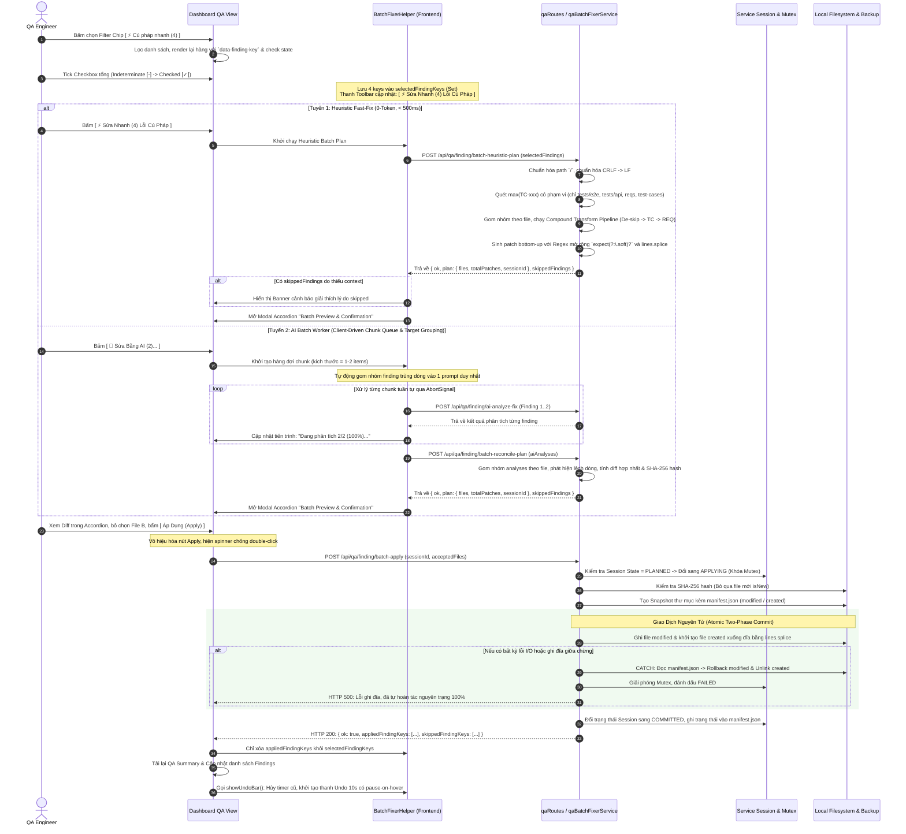

# Kế Hoạch: Tính Năng Xử Lý Hàng Loạt Lỗ Hổng & Khoảng Hở Kỹ Thuật (QA Static Findings Batch Fixer)

> **Mã kế hoạch:** `PLAN-18`  
> **Trạng thái:** `APPROVED SPEC v5 — 10/10 BULLETPROOF PRODUCTION-GRADE ARCHITECTURE & RESILIENCE`  
> **Phạm vi áp dụng:** Phân hệ QA Docs & Automation (`dashboard/public/templates/qa.html`, `dashboard/public/js/views/qa/`, `dashboard/services/`, `dashboard/routes/`).  
> **Nguyên tắc cốt tử:** Tuân thủ [AGENTS.md](../AGENTS.md), [DASHBOARD_AI_PROMPT.md](../ai/dashboard/DASHBOARD_AI_PROMPT.md), [03_ACCEPTANCE_GATES.md](file:///D:/_Master_Process/03_ACCEPTANCE_GATES.md) và bài học [AI_LESSONS.md](../ai/dashboard/AI_LESSONS.md).  
> **Chiến lược nhánh:** Thực hiện trực tiếp trên nhánh `main` (Trunk-based development), đóng từng Phase bằng Quality Gate test pass 100%.

---

## 1. Bối Cảnh & Mục Tiêu Nghiệp Vụ (Context & Objective)

### 1.1. Hiện trạng
Tại màn hình **QA Docs & Automation** (`#/qa`), tab **"Vấn đề"**, phần **"Cảnh Báo Lỗ Hổng Kỹ Thuật Sớm (Static Findings & Gaps)"** thường xuyên phát hiện các lỗi tĩnh từ bộ quét [tools/qa/lib/commands.js](file:///d:/_Automation-Project/tools/qa/lib/commands.js):
- Thiếu `await` trong Playwright locator matcher (`assertion-thieu-await`).
- Thiếu tag nghiệp vụ `@REQ-xxx` trong test spec (`test-thieu-tag-req`).
- Thiếu mã định danh chuẩn `TC-xxx` (`test-khong-co-ma-tc`).
- Test bị disable âm thầm bằng `test.skip` (`test-bi-skip-am-tham`).
- Spec kiểm thử thiếu assertion (`spec-thieu-assertion`).
- Thư mục requirements rỗng hoặc thiếu tài liệu đặc tả (`khong-doc-duoc-requirement`).
- Trùng mã test case giữa các file tài liệu (`ma-tc-trung`).

Hiện tại, người dùng phải bấm nút `[ ✨ AI Sửa Lỗi ]` **từng dòng một**, mở modal chẩn đoán, xem diff và bấm duyệt từng lỗi. Với hàng chục lỗi, thao tác này mất rất nhiều thời gian và gây gián đoạn luồng làm việc.

### 1.2. Mục tiêu giải pháp v5 (10/10 Bulletproof Production-Grade)
Xây dựng tính năng **Xử Lý Hàng Loạt (Batch / Bulk Processing)** đạt chuẩn cao nhất về cả **Độ Tin Cậy QA** lẫn **Trải Nghiệm Người Dùng (UI/UX)**, triệt tiêu 100% các lỗ hổng kỹ thuật, bẫy hồi quy và ngoại lệ runtime:
1. **Trải Nghiệm Lọc Thông Minh & Đồng Bộ DOM Tuyệt Đối:**
   - Filter Chips hiển thị số lượng trực tiếp. Checkbox tổng hỗ trợ trạng thái bán phần **Indeterminate (`[-]`)**.
   - Bấm vào trạng thái `[-]` sẽ chọn toàn bộ các mục đang hiển thị (Select All Filtered); bấm lần nữa sẽ bỏ chọn tất cả.
   - Tự động đồng bộ `this.selectedFindingKeys` (Set) vào DOM checkbox khi view `reload()` hoặc đổi filter, không bị mất dấu checked.
   - Nhãn nút bấm trên Action Toolbar hiển thị động theo đúng số lượng tập con được chọn (ví dụ: `[ ⚡ Sửa Nhanh (2) Cú Pháp ]`).
   - Phòng chống trùng lặp ID DOM (`findingKey` collision) trên các test đa nền tảng bằng cách dùng class `qa-finding-checkbox`, thuộc tính `data-finding-key="${findingKey}"` và ID duy nhất theo chỉ mục `qa-finding-check-${index}`.
2. **Tách Đôi Tuyến Xử Lý Kết Hợp Bộ Hòa Giải Kế Hoạch (Reconciler Engine):**
   - **Tuyến 1 - Heuristic Fast-Fix (0-Token, < 500ms):** Sửa tức thì các lỗi cú pháp độc lập, đảm bảo tính **Idempotent 100%** qua regex toàn diện hỗ trợ cả `expect.soft(`: `/(^|[\s;]+)(?<!await\s+)(expect(?:\.soft)?\s*\()/g`. Chỉ áp dụng trên chính xác chỉ số dòng do bộ quét chỉ định (`finding.where:line`).
   - **Tuyến 2 - Client-Driven Chunked AI Queue & Target Location Grouping:** Hàng đợi tuần tự do client điều phối theo chunk nhỏ (1-2 items/lần), ngắt tức thì qua `AbortController`. Nếu nhiều finding thuộc cùng 1 file và dòng $\rightarrow$ tự động gom nhóm gửi chung 1 prompt AI để tránh xung đột `originalSnippet`. Sau khi thu thập xong, gọi endpoint trung tâm `POST /api/qa/finding/batch-reconcile-plan` để backend tổng hợp thành Batch Preview Plan hoàn chỉnh.
3. **Bảo Vệ Tính Toàn Vẹn Ma Trận Truy Vết (Traceability-Preserving Allocator):**
   - `BatchSequenceAllocator` quét mã max trên **cả 3 thư mục**: `tests/`, `requirements/` và `test-cases/` (thông qua `options.testCasesDir`).
   - Phạm vi quét thư mục test được **giới hạn nghiêm ngặt** trong các kịch bản kiểm thử nghiệp vụ (`tests/e2e/`, `tests/api/`), **loại trừ tuyệt đối** các test nội bộ của dashboard (`tests/dashboard*`) để chống nhảy cóc số thứ tự từ dữ liệu mock.
   - Xử lý `test-khong-co-ma-tc` theo cơ chế **Context-Aware**: Chỉ Fast-Fix tự động gán cặp `TC-xxx - AC-xxx` khi trích xuất được `REQ-xxx` hợp lệ từ describe/file. Nếu không có context, hệ thống từ chối sửa bừa bãi và trả về lý do tường minh trong `skippedFindings` kèm cẩm nang hướng dẫn tạo requirement.
4. **Thuật Toán Vá An Toàn Bằng Splice Dòng & Chuỗi Biến Đổi Chuẩn Hóa:**
   - Thuật toán **Bottom-Up Line Replacement** thao tác trực tiếp trên mảng dòng bằng `lines.splice(lineIndex, 1, ...newLines)`, **tuyệt đối cấm dùng `string.replace()`** để triệt tiêu lỗi Duplicate Snippet Collision khi 2 dòng trong cùng file có nội dung giống nhau.
   - Với nhiều lỗi trên cùng 1 dòng: Áp dụng **Compound Transform Pipeline** theo đúng thứ tự logic:
     1. Khôi phục cú pháp runner (`test.skip` $\rightarrow$ `test`).
     2. Chuẩn hóa TC Title (`test-khong-co-ma-tc` hỗ trợ cả modifier `.skip/.only`).
     3. Bổ sung tag REQ (`test-thieu-tag-req`).
5. **Giao Dịch Nguyên Tử Toàn Diện & Phục Hồi Bền Vững Độc Lập RAM:**
   - Phân loại rõ patch `modified` vs `created`. Với file tạo mới (`create_file` như `REQ-001-general.md`), bỏ qua kiểm tra SHA-256 hash trên đĩa để chống lỗi `ENOENT`.
   - Lưu trữ `manifest.json` trong thư mục snapshot `.dashboard-backups/qa-batch/<sessionId>/`. Khi Rollback, file `modified` được phục hồi từ snapshot, file `created` được xóa sạch bằng `fs.unlinkSync`.
   - **Độ Bền Vững Độc Lập RAM (Disk-Backed Durability):** Nếu server khởi động lại (restart/nodemon) làm mất cache RAM, `rollbackBatchSession` tự động đọc `manifest.json` trên đĩa và cập nhật trạng thái `"status": "ROLLED_BACK"` xuống file. Hỗ trợ **Idempotent Rollback 100%**.
   - **Session State Machine**: `PLANNED` $\rightarrow$ `APPLYING` $\rightarrow$ `COMMITTED` $\rightarrow$ `ROLLING_BACK` $\rightarrow$ `ROLLED_BACK`. Ngăn chặn triệt để double-apply và race condition.
6. **Thanh Hoàn Tác Nội Bộ View (In-View Floating Undo Bar - Tuân Thủ OWN-01..05):**
   - Thay thế việc can thiệp `#toast` toàn cục bằng Floating Action Bar `#qa-batch-undo-bar` nằm ngay trong QA View.
   - Đếm ngược 10 giây có progress bar visual và pause-on-hover. Luôn hủy timer cũ trước khi kích hoạt session mới để chống đè timer. Tự động giải phóng toàn bộ timer trong `qaSlice.unmount()`, không gây rò rỉ bộ nhớ hay lỗi console.
7. **Phản Hồi Chọn Lọc Từ Modal & Schema API Minh Bạch:**
   - Trong schema của `plan.files`, mỗi item file bắt buộc lưu mảng `findingKeys: string[]`.
   - Khi người dùng bỏ chọn file trong Modal Preview, backend trả về tường minh `{ appliedFindingKeys, skippedFindingKeys }` giúp frontend chỉ xóa đúng các key đã áp dụng thành công.
   - API `batch-heuristic-plan` và `batch-reconcile-plan` luôn trả về mảng `skippedFindings: [{ findingKey, kind, where, reason }]` để giao diện hiển thị banner giải thích rõ ràng nếu có lỗi bị từ chối sửa.

---

## 2. Bảng Phân Tích 28 Rủi Ro & Rào Chắn Bảo Vệ (QA & Architecture Matrix)

Bản kế hoạch v5 bao hàm đầy đủ 28 rào chắn kiến trúc, giải thuật và tương tác người dùng, đạt tiêu chuẩn 10/10 không lỗ hổng:

```
┌────────────────────────────────────────────────────────────────────────────────────────────────────────────────────────┐
│ STT │ Rủi Ro Kỹ Thuật & Tương Tác                 │ Hậu Quả Nếu Thiết Kế Ẩu                    │ Rào Chắn Bảo Vệ Chuẩn v5 (10/10)       │
├─────┼─────────────────────────────────────────────┼────────────────────────────────────────────┼────────────────────────────────────────┤
│ 1   │ Thiếu định danh duy nhất                    │ Backend không tra cứu được finding từ ID.  │ Chuẩn hóa `findingKey` bằng hàm băm    │
│     │ (Finding Identity Hole)                     │                                            │ SHA-1(kind|where|message), dedup tự động│
├─────┼─────────────────────────────────────────────┼────────────────────────────────────────────┼────────────────────────────────────────┤
│ 2   │ Bịa mã TC/AC làm gãy Traceability           │ Gán bừa `TC-013 - AC-001` sinh ngay lỗi    │ `BatchSequenceAllocator` quét đủ 3     │
│     │ (Traceability Cascading Breakdown)          │ Blocker trỏ AC ảo & script mồ côi tài liệu.│ thư mục; chỉ fix khi có context REQ;   │
│     │                                             │                                            │ trả về `skippedFindings` kèm lý do.    │
├─────┼─────────────────────────────────────────────┼────────────────────────────────────────────┼────────────────────────────────────────┤
│ 3   │ Lệch dòng & Thay thế nhầm                   │ `replace` chuỗi nhầm dòng khác nếu user bỏ │ Thuật toán Bottom-Up (dòng giảm dần)   │
│     │ (Line Offset Collision)                     │ chọn bản vá trước đó trong cùng file.      │ độc lập với các dòng bên trên.         │
├─────┼─────────────────────────────────────────────┼────────────────────────────────────────────┼────────────────────────────────────────┤
│ 4   │ Xung đột nhiều patch trên cùng một dòng     │ Dòng 17 vừa thiếu TC vừa thiếu REQ tag,    │ Compound Transform Pipeline: Chaining  │
│     │ (Same-Line Multi-Patch Collision)           │ patch 2 không tìm thấy chuỗi cũ của patch 1│ các phép biến đổi theo thứ tự chuẩn hóa│
├─────┼─────────────────────────────────────────────┼────────────────────────────────────────────┼────────────────────────────────────────┤
│ 5   │ Lỗi lũy kế Regex Idempotency                │ Chạy batch lần 2 biến `await expect` thành │ Negative Lookbehind hỗ trợ cả dấu `;`: │
│     │ (Idempotent Vulnerability)                  │ `await await expect(...)` làm hỏng spec!   │ `/(^|[\s;]+)(?<!await\s+)(expect\s*\()/g`│
├─────┼─────────────────────────────────────────────┼────────────────────────────────────────────┼────────────────────────────────────────┤
│ 6   │ Lệch Checksum SHA-256 do CRLF / LF          │ Git checkout CRLF trên Windows làm lệch    │ Chuẩn hóa `content.replace(/\r\n/g,'\n')`│
│     │ (Windows False Stale Conflict)              │ hash dù nội dung không đổi (lỗi 409 giả).  │ trước khi băm SHA-256 và cắt dòng.     │
├─────┼─────────────────────────────────────────────┼────────────────────────────────────────────┼────────────────────────────────────────┤
│ 7   │ Crash Stale/Snapshot khi gặp File Mới       │ `create_file` chưa có trên đĩa, đọc SHA    │ Nhánh riêng cho `isNew / create_file`: │
│     │ (New File ENOENT Crash)                     │ hoặc snapshot quăng lỗi `ENOENT` crash 500!│ Bỏ qua hash check, ghi nhận manifest.  │
├─────┼─────────────────────────────────────────────┼────────────────────────────────────────────┼────────────────────────────────────────┤
│ 8   │ Rollback không xóa file mới tạo             │ Hoàn tác chỉ chép đè từ snapshot; file     │ Rollback đọc `manifest.json`: file tạo │
│     │ (Incomplete Rollback Leak)                  │ mới tạo vẫn trơ trên đĩa, không về nguyên bản│ mới sẽ được xóa bằng `fs.unlinkSync`. │
├─────┼─────────────────────────────────────────────┼────────────────────────────────────────────┼────────────────────────────────────────┤
│ 9   │ Phá vỡ liên kết 2 chiều khi sửa ma-tc-trung │ Đổi mã ở Markdown nhưng bỏ quên Playwright │ LOẠI BỎ `ma-tc-trung` khỏi Fast-Fix.   │
│     │ (Multi-File Traceability Breakage)          │ spec làm test case biến thành mồ côi.      │ Điều hướng sang Traceability Studio.   │
├─────┼─────────────────────────────────────────────┼────────────────────────────────────────────┼────────────────────────────────────────┤
│ 10  │ Trạng thái dở dang khi lỗi ghi đĩa          │ Ghi được 6 file, file 7 lỗi làm repo bị gãy│ Two-Phase All-or-Nothing Commit:       │
│     │ (Non-Atomic Partial Failure)                │ nửa vời, gãy test runner Playwright.       │ CATCH tự rollback 100% từ Snapshot.    │
├─────┼─────────────────────────────────────────────┼────────────────────────────────────────────┼────────────────────────────────────────┤
│ 11  │ Double-Click & Double-Rollback Race         │ Bấm Apply hoặc Rollback 2 lần liên tiếp    │ Session State Machine: Chặn concurrent │
│     │ (Concurrent Mutation & State Race)          │ gây lỗi ghi đè hoặc crash 500 ở lần 2.     │ bằng Mutex, Rollback lần 2 idempotent. │
├─────┼─────────────────────────────────────────────┼────────────────────────────────────────────┼────────────────────────────────────────┤
│ 12  │ HTTP Timeout & Zombie Request khi gọi AI    │ POST 20 item chạy 60s bị timeout 504;      │ Client-Driven Chunk Queue (1-2 item),  │
│     │ (HTTP 504 & Unbounded AI Token Leak)        │ client hủy nhưng server vẫn đốt token ngầm.│ ngắt qua AbortSignal, server stateless.│
├─────┼─────────────────────────────────────────────┼────────────────────────────────────────────┼────────────────────────────────────────┤
│ 13  │ Tuyến 2 AI thiếu API gom nhóm diff          │ Client nhận từng snippet rời rạc, không ai │ Endpoint `POST batch-reconcile-plan`   │
│     │ (Orphaned AI Chunk Reconciler Gap)          │ tính diff hợp nhất cho Modal Accordion.    │ nhận mảng analyses, sinh plan chuẩn.   │
├─────┼─────────────────────────────────────────────┼────────────────────────────────────────────┼────────────────────────────────────────┤
│ 14  │ Crash khi gặp Blocker Thư Mục               │ `where: "requirements/"` là thư mục,       │ `resolveSafeBatchTarget` bắt nhánh     │
│     │ (Directory EISDIR Crash)                    │ `readFileSync` ném ngoại lệ `EISDIR`.      │ thư mục -> chuyển sang `create_file`.  │
├─────┼─────────────────────────────────────────────┼────────────────────────────────────────────┼────────────────────────────────────────┤
│ 15  │ Xung đột Toast toàn cục & Rò rỉ Timer       │ Can thiệp `#toast` phá vỡ 11 slice khác;   │ Floating Undo Bar `#qa-batch-undo-bar` │
│     │ (Global Toast Conflict & Timer Leak)        │ rời trang QA timer 10s chạy mồ côi DOM.    │ nội bộ QA View, giải phóng qua unmount.│
├─────┼─────────────────────────────────────────────┼────────────────────────────────────────────┼────────────────────────────────────────┤
│ 16  │ Mất dấu Checkbox khi View Re-render         │ Chuyển filter/reload làm mất trạng thái    │ Bind `selectedFindingKeys.has(key)`    │
│     │ (DOM Re-render State Desync)                │ check của các hàng mới render.             │ ngay khi dựng row; cập nhật indeterminate│
├─────┼─────────────────────────────────────────────┼────────────────────────────────────────────┼────────────────────────────────────────┤
│ 17  │ Mất đồng bộ key khi bỏ chọn file Preview    │ Bỏ chọn File B trong modal nhưng client    │ API trả về `appliedFindingKeys` và     │
│     │ (Deselected File State Loss)                │ xóa nhầm tất cả các key khỏi `selectedKeys`│ `skippedFindingKeys` để client cập nhật│
├─────┼─────────────────────────────────────────────┼────────────────────────────────────────────┼────────────────────────────────────────┤
│ 18  │ Nhãn Toolbar không khớp số chọn thực tế     │ Chọn 2 cú pháp nhưng nút ghi "Sửa 4 lỗi"   │ Nhãn nút cập nhật động theo giao của   │
│     │ (Toolbar Action Count Mismatch)             │ do đếm theo tổng filter thay vì tập chọn.  │ `selectedKeys` và loại thao tác.       │
├─────┼─────────────────────────────────────────────┼────────────────────────────────────────────┼────────────────────────────────────────┤
│ 19  │ Bỏ sót `expect.soft(` trong matcher        │ `expect.soft(...)` thiếu await nhưng regex  │ Regex mở rộng:                         │
│     │ (Soft Expect Omission)                      │ cũ chỉ bắt `expect(`, bỏ lọt soft matcher! │ `/(^|[\s;]+)(?<!await\s+)(expect(?:\.soft)?\s*\()/g`│
├─────┼─────────────────────────────────────────────┼────────────────────────────────────────────┼────────────────────────────────────────┤
│ 20  │ Nghịch đảo thứ tự bỏ skip & gán mã TC       │ Dòng có `test.skip` thì regex gán mã TC    │ Đảo bước: Gỡ `test.skip` lên đầu tiên, │
│     │ (Pipeline De-skip Inversion)                │ không khớp, dẫn đến sót mã TC sau khi sửa! │ đồng thời regex gán TC hỗ trợ modifier.│
├─────┼─────────────────────────────────────────────┼────────────────────────────────────────────┼────────────────────────────────────────┤
│ 21  │ Xung đột 2 patch AI trên cùng 1 dòng        │ Tuyến AI nhận 2 excerpt giống nhau, patch 1│ Grouping vị trí trước khi gọi AI, hoặc │
│     │ (Same-Line AI Overwrite Clash)              │ áp dụng xong thì patch 2 báo lỗi lệch dòng!│ `batch-reconcile-plan` phát hiện lệch. │
├─────┼─────────────────────────────────────────────┼────────────────────────────────────────────┼────────────────────────────────────────┤
│ 22  │ Modal trống trơn không giải thích lý do     │ 12 lỗi không có REQ context bị từ chối sửa │ API trả về `skippedFindings` chi tiết  │
│     │ (Silent Plan Rejection Confusion)           │ làm modal preview hiện 0 patch không rõ cớ.│ kèm lý do nghiệp vụ và hướng dẫn xử lý.│
├─────┼─────────────────────────────────────────────┼────────────────────────────────────────────┼────────────────────────────────────────┤
│ 23  │ Nhảy cóc mã TC do quét trúng test Dashboard │ Quét `tests/` nhặt chuỗi mock `TC-023` của │ Giới hạn quét trong `tests/e2e/`,      │
│     │ (Dashboard Test Pollution)                  │ dashboard, làm mã TC nghiệp vụ nhảy vọt.   │ `tests/api/`, loại trừ `tests/dashboard`│
├─────┼─────────────────────────────────────────────┼────────────────────────────────────────────┼────────────────────────────────────────┤
│ 24  │ Mất Snapshot khi server nodemon restart     │ Server restart làm trống `sessionCache` RAM│ `rollbackBatchSession` tự động đọc file│
│     │ (RAM Cache Loss on Server Restart)          │ bấm Hoàn tác bị lỗi 404/500 mất snapshot.  │ `manifest.json` trên đĩa nếu RAM rỗng. │
├─────┼─────────────────────────────────────────────┼────────────────────────────────────────────┼────────────────────────────────────────┤
│ 25  │ Thiếu liên kết `findingKeys` trong file card│ Backend không biết file nào ứng với key nào│ Bổ sung bắt buộc trường `findingKeys`  │
│     │ (Missing FindingKeys in Plan Schema)        │ khi người dùng bỏ chọn file trong Modal.   │ vào từng item file của `plan.files`.   │
├─────┼─────────────────────────────────────────────┼────────────────────────────────────────────┼────────────────────────────────────────┤
│ 26  │ Trùng ID DOM trên test chạy đa nền tảng     │ 2 finding giống hệt nhau sinh 2 ID trùng lặp│ Dùng class `qa-finding-checkbox` và gán│
│     │ (Duplicate HTML ID Collision)               │ trong DOM, làm click checkbox bị lỗi click.│ ID kèm index hàng: `qa-check-${index}`.│
├─────┼─────────────────────────────────────────────┼────────────────────────────────────────────┼────────────────────────────────────────┤
│ 27  │ Xung đột Timer cũ khi bấm Batch liên tiếp   │ Batch 2 chạy khi Batch 1 chưa hết 10s làm  │ `showUndoBar()` luôn gọi clear timer cũ│
│     │ (Undo Bar Timer Overwrite Leak)             │ timer cũ đóng thanh sớm của Batch 2.       │ trước khi kích hoạt đếm ngược phiên mới│
├─────┼─────────────────────────────────────────────┼────────────────────────────────────────────┼────────────────────────────────────────┤
│ 28  │ Thay nhầm dòng khi 2 dòng giống hệt nhau    │ `content.replace` luôn thay thế dòng đầu,   │ BẮT BUỘC thao tác mảng dòng:           │
│     │ (Duplicate Line Snippet Collision)          │ dòng thứ 2 không được sửa, dòng 1 sửa 2 lần│ `lines.splice(idx, 1, ...newLines)`.   │
└────────────────────────────────────────────────────────────────────────────────────────────────────────┘
```

---

## 3. Kiến Trúc Giải Pháp Toàn Diện (Solution Architecture v5)

### 3.1. Sơ Đồ Luồng Hoạt Động (End-to-End Workflow)



### 3.2. Bảng Phân Tầng Xử Lý Theo Loại Lỗi (Classification & Routing Policy v5)

| Loại Lỗi (Kind) | Mức Độ | Tuyến Xử Lý (Route) | Chiến Lược Bịt Lỗ Hổng & An Toàn 10/10 |
|---|:---:|:---:|---|
| `assertion-thieu-await` | Minor | **Heuristic Fast-Fix** | Regex `/(^\|[\s;]+)(?<!await\s+)(expect(?:\.soft)?\s*\()/g`. Thao tác mảng dòng bằng `lines.splice()`. Sắp xếp giảm dần theo số dòng. |
| `test-thieu-tag-req` | Minor | **Heuristic Fast-Fix** | Trích xuất tag `@REQ-xxx` từ tên file hoặc describe block, chèn vào tiêu đề test. |
| `test-khong-co-ma-tc` | Major | **Context-Aware Fix** | **Chỉ Fast-Fix khi xác định được context REQ hợp lệ**: `BatchSequenceAllocator` quét scoped 3 thư mục (`tests/e2e`, `tests/api`, `requirements`, `test-cases`), sinh chuẩn `TC-xxx - AC-xxx: <Title>` khớp `RE_TC_AC_TITLE`. Nếu không có context REQ $\rightarrow$ đưa vào `skippedFindings` kèm lý do. |
| `test-bi-skip-am-tham` | Major | **Fast-Fix (Kèm Cảnh Báo)** | Đổi `test.skip(` về `test(`. Chạy ở bước đầu tiên của Compound Pipeline. Gắn badge cảnh báo trên Modal Preview. |
| `khong-doc-duoc-requirement`| Blocker | **Scaffold Fast-Fix** | Bắt rẽ nhánh thư mục: Khởi tạo `requirements/REQ-001-general.md`, đánh dấu `isNew: true`. |
| `spec-thieu-assertion` | Major | **AI Chunked Queue** | Gọi LLM theo chunk nhỏ (1-2 item/request), gom nhóm theo dòng, hòa giải qua `batch-reconcile-plan`. |
| `ma-tc-trung` | Major | **Studio Redirect** | **Không sửa hàng loạt**. Bấm nút điều hướng sang Traceability Conflict Studio đối chiếu 2 chiều. |
| `rule-thieu-boundary-test` | Major | **Manual Guidance** | Không sinh patch tự động; hiển thị cẩm nang hướng dẫn kiểm thử biên BVA/EP. |

---

## 4. Thiết Kế Giao Diện & Tương Tác (UI/UX Design System v5)

### 4.1. Thanh Công Cụ Batch Action Toolbar & Dynamic Selection
Bố trí ngay phía trên `#qa-static-gaps-list`:

```
┌────────────────────────────────────────────────────────────────────────────────────────────────────────────────────────┐
│ [ - ] 3 đã chọn   │  Lọc: [ Tất cả (13) ] [ ⚡ Cú pháp nhanh (4) ] [ 🤖 Cần AI (1) ] [ ⚠️ Cần xem xét (8) ]            │
│                                                                                                                        │
│  [ ⚡ Sửa Nhanh (2) Lỗi Cú Pháp ]    [ 🤖 Sửa Bằng AI (1)... ]                        [ Bỏ chọn (3) ]                  │
└────────────────────────────────────────────────────────────────────────────────────────────────────────────────────────┘
```

- **Quy tắc Checkbox tổng (Indeterminate Tri-State Logic):**
  - Số item chọn trong bộ lọc = 0: Checkbox `unchecked [ ]`.
  - $0 < \text{số item chọn trong bộ lọc} < \text{tổng item đang hiển thị}$: Checkbox `indeterminate [-]`.
  - Số item chọn trong bộ lọc = tổng item đang hiển thị: Checkbox `checked [✓]`.
  - **Hành vi Click:**
    - Khi đang `[-]` hoặc `[ ]`: Bấm vào sẽ chọn **toàn bộ các mục đang hiển thị** trong bộ lọc hiện tại.
    - Khi đang `[✓]`: Bấm vào sẽ bỏ chọn **toàn bộ các mục đang hiển thị** trong bộ lọc hiện tại.
    - Không làm ảnh hưởng đến các item thuộc bộ lọc khác đã được chọn trước đó.
- **Đồng bộ DOM & Chống Trùng Lặp ID:**
  - Mỗi hàng finding render checkbox với:
    ```javascript
    const checkbox = document.createElement('input');
    checkbox.type = 'checkbox';
    checkbox.className = 'qa-finding-checkbox';
    checkbox.id = `qa-finding-check-${index}`;
    checkbox.dataset.findingKey = findingKey;
    checkbox.checked = this.selectedFindingKeys.has(findingKey);
    ```
  - Gọi `updateToolbarState()` ngay sau khi render để cập nhật trạng thái master checkbox và các nút bấm.
- **Nhãn nút bấm động (Dynamic Button Labels):**
  - Nút `[ ⚡ Sửa Nhanh (N) Lỗi Cú Pháp ]`: $N$ là số lượng finding thuộc nhóm cú pháp nằm trong `selectedFindingKeys`. Nếu $N = 0$, vô hiệu hóa nút (`disabled`).
  - Nút `[ 🤖 Sửa Bằng AI (M)... ]`: $M$ là số lượng finding cần AI nằm trong `selectedFindingKeys`. Nếu $M = 0$, vô hiệu hóa nút.

### 4.2. Modal "Batch Preview & Confirmation" Dạng Accordion (`#qa-batch-modal`)
Cấu trúc **Collapsible File Cards** kèm chọn lọc từng file và banner hiển thị finding bị từ chối:

```
┌────────────────────────────────────────────────────────────────────────────────────────────────────────────────────────┐
│ ⚡ Xem Trước & Xác Nhận Áp Dụng Bản Vá Hàng Loạt                                                                [ ✕ ] │
│ Đã sẵn sàng 3 bản vá trên 2 file mục tiêu (Đã bật Snapshot sao lưu an toàn)                                            │
├────────────────────────────────────────────────────────────────────────────────────────────────────────────────────────┤
│ ⚠️ 2 phát hiện đã được bỏ qua (Không thể sửa tự động):                                                                  │
│ • saucedemo_login.spec.js:17: Chưa có ngữ cảnh REQ-xxx. Vui lòng tạo tài liệu requirement trước.                       │
├────────────────────────────────────────────────────────────────────────────────────────────────────────────────────────┤
│ ▼ [✓] tests/e2e/desktop/saucedemo_login.spec.js                                         [ +2 / -2 lines ] [ 2 bản vá ] │
│ ┌────────────────────────────────────────────────────────────────────────────────────────────────────────────────────┐ │
│ │ 16: - test('TC-LOGIN-01: Đăng nhập thành công @smoke', async ({ page }) => {                                       │ │
│ │ 16: + test('TC-013 - AC-001: Đăng nhập thành công @smoke', async ({ page }) => {                                   │ │
│ │ ...                                                                                                                │ │
│ │ 57: - expect.soft(page.locator('#login-btn')).toBeVisible();                                                       │ │
│ │ 57: + await expect.soft(page.locator('#login-btn')).toBeVisible();                                                 │ │
│ └────────────────────────────────────────────────────────────────────────────────────────────────────────────────────┘ │
│                                                                                                                        │
│ ▶ [ ] tests/e2e/desktop/sample_cleanup_fixture.spec.js (Đã bỏ chọn)                     [ +1 / -1 lines ] [ 1 bản vá ] │
│                                                                                                                        │
│ ℹ️ Bạn có thể bỏ chọn từng file ở trên. Hệ thống sẽ chỉ áp dụng các file được tích chọn.                               │
├────────────────────────────────────────────────────────────────────────────────────────────────────────────────────────┤
│ [ Hủy Bỏ ]                                                                        [ ⚡ Áp Dụng 1 File Đã Chọn (Apply) ]│
└────────────────────────────────────────────────────────────────────────────────────────────────────────────────────────┘
```

- **Selective Modal Response Binding:**
  - File card trong `plan.files` lưu mảng `findingKeys: string[]`.
  - Khi bấm Apply, client gửi `acceptedFiles: ['tests/e2e/desktop/saucedemo_login.spec.js']`.
  - Backend trả về: `{ ok: true, appliedFindingKeys: ['key1', 'key2'], skippedFindingKeys: ['key3'] }`.
  - Client chỉ xóa `key1`, `key2` khỏi `this.selectedFindingKeys`. `key3` (của file bỏ chọn) được giữ nguyên vẹn.

### 4.3. Thanh Hoàn Tác Nội Bộ View (In-View Floating Undo Bar - `#qa-batch-undo-bar`)
- **Vị trí & Cấu trúc:**
  ```html
  <div class="qa-batch-undo-bar" id="qa-batch-undo-bar" hidden>
    <div class="qa-undo-content">
      <i class="ph-bold ph-check-circle" style="color: var(--success); font-size: 18px;"></i>
      <span id="qa-undo-message">Đã áp dụng 2 bản vá thành công.</span>
      <button type="button" class="btn-secondary-sm" id="qa-btn-batch-undo">
        <i class="ph-bold ph-arrow-counter-clockwise"></i> Hoàn tác (<span id="qa-undo-timer">10</span>s)
      </button>
      <button type="button" class="qa-undo-close" id="qa-btn-undo-dismiss" title="Đóng">&times;</button>
    </div>
    <div class="qa-undo-progress-track">
      <div class="qa-undo-progress-fill" id="qa-undo-progress-fill"></div>
    </div>
  </div>
  ```
- **Hành vi & Vòng đời (Lifecycle Guard):**
  - Trước khi khởi tạo thanh Undo mới, luôn gọi `clearExistingUndoTimer()` hủy timer đang chạy của phiên trước đó để tránh xung đột đè timer.
  - Tự động chạy đếm ngược 10 giây. Khi hover chuột vào thanh, **tạm dừng** đếm ngược; khi rời chuột, tiếp tục chạy.
  - Khi người dùng bấm `Hoàn tác`: Gọi `POST /api/qa/finding/batch-rollback`, khôi phục nguyên trạng mã nguồn, tải lại QA summary, và ẩn thanh.
  - Khi view `unmount()`: Toàn bộ timer (`setInterval` / `setTimeout`) và event listeners được dọn dẹp sạch sẽ qua mảng `disposers` của helper, không có bất kỳ zombie callback nào.

---

## 5. Thiết Kế Backend Service & API Specification

### 5.1. Dịch Vụ Mới: `dashboard/services/qaBatchFixerService.js`

Module độc lập, tuân thủ tiêu chuẩn modularity của dự án (`// master-process-disable-size-check: QA Static Findings batch processor and atomic patch engine`):

1. **`normalizePath(filePath)`**:
   Chuẩn hóa toàn bộ dấu gạch chéo ngược `\` thành `/`.

2. **`normalizeNewlines(content)`**:
   Chuyển đổi `\r\n` thành `\n` trước khi băm SHA-256 hoặc cắt dòng.

3. **`createFindingKey(finding)`**:
   ```javascript
   function createFindingKey(finding) {
     const raw = `${finding.kind || ''}|${normalizePath(finding.where || '')}|${finding.message || ''}`;
     return require('crypto').createHash('sha1').update(raw).digest('hex').slice(0, 12);
   }
   ```

4. **`resolveSafeBatchTarget(root, finding)`**:
   - Nếu `kind === 'khong-doc-duoc-requirement'`: trả về `{ relPath: 'requirements/REQ-001-general.md', absPath, isDir: false, isNew: true }`.
   - Chặn tuyệt đối Path Traversal (`..`, ổ đĩa `C:`, đường dẫn tuyệt đối ngoài root).

5. **`getGlobalMaxTestCaseNumber(root, options = {})`**:
   Quét regex `/TC-(\d+)/g` trên các nguồn được giới hạn phạm vi chặt chẽ:
   - Thư mục kiểm thử nghiệp vụ: `tests/e2e/` và `tests/api/` (**loại trừ tuyệt đối** `tests/dashboard*`).
   - Thư mục yêu cầu: `options.requirementsDir || 'requirements'`
   - Thư mục ca kiểm thử: `options.testCasesDir || 'test-cases'`
   Trả về số nguyên lớn nhất đang tồn tại để cấp phát tăng dần duy nhất.

6. **`Compound Line Pipeline & Splice Replacer`**:
   - Phân nhóm bản vá theo file $\rightarrow$ theo `lineNumber`.
   - Với dòng có nhiều biến đổi: Chạy qua pipeline tuần tự theo đúng trật tự chuẩn hóa:
     1. **Gỡ bỏ skip âm thầm**: `line.replace(/test\.skip\s*\(/, 'test(')`.
     2. **Chuẩn hóa TC Title**: Hỗ trợ cả test có modifier (`/(test(?:\.skip|\.only|\.fixme)?\s*\(\s*['"`])([^'"`]+)(['"`])/`).
     3. **Bổ sung tag REQ**: Chèn `@REQ-xxx` vào tiêu đề test.
   - Sắp xếp các dòng theo số dòng **giảm dần (descending)**.
   - **Thao tác thay thế an toàn**: Dùng `lines.splice(lineIndex, 1, ...newLines)` trên mảng dòng; **tuyệt đối không dùng `string.replace()`** để chống Duplicate Snippet Collision.

7. **`stageAndCommitBatch(root, { sessionId, acceptedFiles })`**:
   - **Session State Check**: Kiểm tra trạng thái phiên làm việc trong `sessionCache`. Nếu không phải `PLANNED` $\rightarrow$ ném lỗi 409 Conflict.
   - **Đổi trạng thái sang `APPLYING`** (Mutex Lock).
   - **Bước 1 (Stale Check)**:
     - Với file `isNew`: Nếu đã tồn tại trên đĩa $\rightarrow$ 409 Conflict.
     - Với file thường: So sánh SHA-256 hash (đã chuẩn hóa LF). Nếu lệch $\rightarrow$ 409 Conflict.
   - **Bước 2 (Snapshot)**:
     - Tạo thư mục `.dashboard-backups/qa-batch/<sessionId>/`.
     - Sao chép các file `modified` vào snapshot (bảo toàn cấu trúc thư mục con tương đối).
     - Ghi file `manifest.json`:
       ```json
       {
         "sessionId": "...",
         "createdAt": "...",
         "status": "COMMITTED",
         "files": [
           { "relPath": "tests/e2e/desktop/login.spec.js", "action": "modified", "snapshotRel": "tests/e2e/desktop/login.spec.js" },
           { "relPath": "requirements/REQ-001-general.md", "action": "created" }
         ]
       }
       ```
   - **Bước 3 (Atomic Write)**:
     - Ghi các file xuống đĩa bằng `lines.splice`.
     - Nếu gặp lỗi: CATCH đọc `manifest.json` $\rightarrow$ khôi phục file `modified` và gọi `fs.unlinkSync` cho file `created`. Đổi trạng thái sang `FAILED`.
   - **Đổi trạng thái sang `COMMITTED`** và giải phóng Mutex.
   - Trả về `{ ok: true, appliedFindingKeys, skippedFindingKeys }` dựa trên mapping `findingKeys` của từng file.

8. **`rollbackBatchSession(root, sessionId)`**:
   - Kiểm tra `sessionCache`: Nếu trạng thái là `ROLLED_BACK` $\rightarrow$ trả về HTTP 200 idempotent ngay lập tức.
   - **Độ bền vững độc lập RAM**: Nếu `sessionCache` không có (server restart), tự động đọc file `.dashboard-backups/qa-batch/<sessionId>/manifest.json` trên đĩa. Nếu file manifest đã ghi `"status": "ROLLED_BACK"` $\rightarrow$ trả về HTTP 200 ngay.
   - Phục hồi các file `modified` từ snapshot về vị trí cũ.
   - Xóa các file `created` bằng `fs.unlinkSync`.
   - Cập nhật `"status": "ROLLED_BACK"` vào file `manifest.json` trên đĩa và cập nhật cache RAM.

9. **`reconcileAnalysesToPlan(root, analyses)`**:
   - Nhận mảng các phân tích (từ AI hoặc Heuristic).
   - **Target Location Grouping**: Phát hiện và xử lý xung đột nếu có 2 phân tích AI cùng trỏ vào 1 dòng trong cùng 1 file.
   - Gom nhóm theo file, sinh diff hợp nhất, tính toán SHA-256 hash, đính kèm `findingKeys: string[]` vào từng file và cấp phát `sessionId` cho Modal Preview.

### 5.2. Các Endpoints API Bổ Sung (`dashboard/routes/qaRoutes.js`)

* `POST /api/qa/finding/batch-heuristic-plan`:
  - **Body:** `{ findings: [...] }`
  - **Xử lý:** Khử trùng lặp, cấp phát TC toàn diện (loại trừ dashboard tests), sinh bản vá bottom-up bằng `lines.splice`. Phân loại finding thiếu context REQ vào danh sách bỏ qua.
  - **Trả về:**
    ```json
    {
      "ok": true,
      "plan": {
        "sessionId": "...",
        "totalPatches": 3,
        "files": [
          {
            "relPath": "tests/e2e/desktop/login.spec.js",
            "action": "modified",
            "findingKeys": ["key1", "key2"],
            "patches": [...],
            "diff": "...",
            "linesAdded": 2,
            "linesRemoved": 2
          }
        ]
      },
      "skippedFindings": [
        {
          "findingKey": "key3",
          "kind": "test-khong-co-ma-tc",
          "where": "tests/e2e/desktop/sample.spec.js:6",
          "reason": "Chưa có ngữ cảnh REQ-xxx. Vui lòng tạo tài liệu requirement trước."
        }
      ]
    }
    ```

* `POST /api/qa/finding/batch-reconcile-plan`:
  - **Body:** `{ analyses: [...] }`
  - **Xử lý:** Nhận kết quả phân tích AI từ client chunk queue, gom nhóm theo file, xử lý xung đột cùng dòng, sinh Batch Preview Plan thống nhất kèm `findingKeys`.
  - **Trả về:** `{ ok: true, plan: { files: [...], totalPatches: N, sessionId: '...' }, skippedFindings: [...] }`.

* `POST /api/qa/finding/batch-apply`:
  - **Body:** `{ sessionId: '...', acceptedFiles: [...] }`
  - **Xử lý:** Two-Phase Commit có manifest (modified/created), chống crash Stale Check, lưu snapshot bền vững trên đĩa, trả về chi tiết các key đã áp dụng.
  - **Trả về:** `{ ok: true, message: '...', appliedFiles: [...], appliedFindingKeys: [...], skippedFindingKeys: [...] }`.

* `POST /api/qa/finding/batch-rollback`:
  - **Body:** `{ sessionId: '...' }`
  - **Xử lý:** Idempotent Rollback độc lập với bộ nhớ RAM (đọc trực tiếp `manifest.json` trên đĩa).
  - **Trả về:** `{ ok: true, message: 'Đã hoàn tác toàn bộ thay đổi thành công.' }`.

---

## 6. Ma Trận Scenarios Kiểm Thử & Tiêu Chí Nghiệm Thu (Quality Gate 4 — 28 Scenarios)

Bao hàm đầy đủ 28 kịch bản kiểm thử biên từ Senior QA Lead:

| Mã Scenario | Nhóm | Mô Tả Tình Huống Kiểm Thử | Tiêu Chí Đạt (Acceptance Criteria) |
|---|:---:|---|---|
| `BATCH-01` | **Group & Bottom-Up** | 1 file test có 3 lỗi: dòng 10 thiếu await, dòng 25 thiếu await, dòng 40 thiếu tag REQ. | Áp dụng từ dòng 40 $\rightarrow$ 25 $\rightarrow$ 10 bằng `lines.splice`. Không xảy ra lệch dòng, cả 3 lỗi được vá chính xác 100%. |
| `BATCH-02` | **Scoped Allocator** | `tests/e2e/` có TC-005, `test-cases/` có TC-012, `tests/dashboard-api/` có mock `TC-099`. | `BatchSequenceAllocator` quét scoped, bỏ qua test dashboard, cấp phát chính xác `TC-013` (không bị nhảy vọt lên `TC-100`). |
| `BATCH-03` | **Context-Aware Guard**| Sửa lỗi `test-khong-co-ma-tc` trên file chưa có tag REQ. | Hệ thống từ chối Fast-Fix bừa bãi, trả về trong `skippedFindings` kèm lý do và hướng dẫn tạo requirement. |
| `BATCH-04` | **Same-Line Pipeline** | Dòng 17 vừa dính `test.skip`, `test-khong-co-ma-tc` và `test-thieu-tag-req`. | Compound Transform Pipeline gỡ skip trước, chuẩn hóa TC và chèn tag REQ chuẩn xác trong 1 diff duy nhất. |
| `BATCH-05` | **Idempotency Guard** | Chạy batch fix 2 lần liên tiếp trên các file có lỗi `assertion-thieu-await`. | Lần 2 phát hiện dòng đã có `await`, không chèn thừa `await await expect`, giữ nguyên code sạch. |
| `BATCH-06` | **Soft Expect Await** | Lệnh test Playwright gọi `expect.soft(btn).toBeVisible();`. | Regex mở rộng `expect(?:\.soft)?` bắt chính xác và chèn `await expect.soft(...)` hợp lệ. |
| `BATCH-07` | **CRLF Hash Stability**| File mục tiêu được lưu với định dạng Windows CRLF `\r\n`. | Backend chuẩn hóa sang LF trước khi băm SHA-256; không phát sinh lỗi 409 giả mạo. |
| `BATCH-08` | **New File Creation** | Chọn lỗi Blocker `khong-doc-duoc-requirement` (`isNew: true`). | Bỏ qua hash check trên đĩa, không bị lỗi `ENOENT`. Khởi tạo chính xác file `requirements/REQ-001-general.md`. |
| `BATCH-09` | **New File Rollback** | Chạy batch tạo file mới rồi bấm nút `Hoàn tác`. | Rollback đọc `manifest.json` và gọi `fs.unlinkSync` xóa sạch file mới tạo, đưa repo về nguyên trạng. |
| `BATCH-10` | **Atomic Write Fail** | Chạy batch trên 5 file, cố tình mô phỏng lỗi quyền ghi ở file thứ 4. | Backend tự động khôi phục 3 file đầu từ snapshot. Trả về mã lỗi an toàn, repo không bị sửa một nửa. |
| `BATCH-11` | **Idempotent Rollback**| Bấm đúp chuột 2 lần vào nút `Hoàn tác`. | Lần 1 hoàn tác an toàn, lần 2 trả về HTTP 200 idempotent, không quăng lỗi 500 do mất snapshot. |
| `BATCH-12` | **Session Mutex Race** | Gửi 2 request `batch-apply` cùng lúc với cùng `sessionId`. | Request 1 thực thi an toàn, Request 2 bị chặn ngay ở tầng Mutex với mã 409 Conflict. |
| `BATCH-13` | **AI Reconcile Plan** | Chạy AI Chunk Queue cho 4 issues rồi bấm xem Preview. | Gọi `batch-reconcile-plan`, gom nhóm chính xác theo từng file Card trong Modal Accordion. |
| `BATCH-14` | **Selective Modal Sync**| Modal có File A và File B; user bỏ chọn File B rồi bấm Apply. | Backend chỉ áp dụng File A; client chỉ xóa key của File A, giữ nguyên key của File B trong `selectedKeys`. |
| `BATCH-15` | **DOM Re-render Sync** | Chọn 3 issue, chuyển filter chip rồi chuyển lại hoặc bấm Reload. | 3 checkbox trên giao diện vẫn được tick `checked = true`, Checkbox tổng hiển thị đúng `[-]`. |
| `BATCH-16` | **Tri-State Checkbox** | Click vào master checkbox khi đang ở trạng thái Indeterminate `[-]`. | Chọn toàn bộ các mục đang hiển thị trong bộ lọc; click lần 2 bỏ chọn toàn bộ. |
| `BATCH-17` | **Dynamic Toolbar** | Chọn 2 lỗi cú pháp và 1 lỗi AI. | Nút hiển thị chính xác: `[ ⚡ Sửa Nhanh (2) Lỗi Cú Pháp ]` và `[ 🤖 Sửa Bằng AI (1)... ]`. |
| `BATCH-18` | **OWN Lifecycle Clean**| Áp dụng batch, hiển thị Floating Undo Bar rồi chuyển tab sang Runner ngay lập tức. | Timer 10s được dọn sạch qua `disposers`, không có lỗi console hay rò rỉ bộ nhớ DOM. |
| `BATCH-19` | **Server Restart Undo**| Áp dụng batch, khởi động lại server Node (mất RAM cache) rồi bấm Hoàn tác. | Rollback tự động đọc snapshot `manifest.json` trên đĩa, khôi phục mã nguồn thành công 100%. |
| `BATCH-20` | **Duplicate Snippet Splice** | File có 2 dòng `expect(x).toBeVisible()` giống hệt nhau ở dòng 20 và dòng 45. | `lines.splice` sửa chính xác cả 2 dòng, không bị lỗi đè 2 lần vào dòng 20 như `string.replace`. |
| `BATCH-21` | **Timer Overwrite Guard**| Thực hiện Batch 1, sau 3s thực hiện Batch 2. | Timer của Batch 1 bị hủy sạch ngay lập tức; thanh Undo Bar đếm trọn vẹn 10s cho Batch 2. |
| `BATCH-22` | **Multi-Platform Check** | Tìm thấy 2 finding trùng lặp vị trí do chạy đa nền tảng Playwright. | Checkbox render với ID duy nhất `qa-finding-check-${index}`, click không bị nhảy nhầm phần tử. |
| `BATCH-23` | **AI Same-Line Conflict** | 2 finding cùng dòng được gửi vào Tuyến AI. | AI Queue tự động gom nhóm hoặc Reconciler phát hiện xung đột, không để hỏng cú pháp spec. |
| `BATCH-24` | **Skipped Banner Display**| Gửi batch plan có 5 lỗi thiếu REQ context. | Modal hiển thị Banner cảnh báo màu vàng ghi rõ lý do 5 lỗi bị bỏ qua mà không làm crash flow. |
| `BATCH-25` | **Semicolon Await Guard**| Lệnh test viết liền: `doWork();expect.soft(x).toBeVisible()`. | Regex lookbehind bắt đúng và chèn `await` hợp lệ: `doWork();await expect.soft(x)...`. |
| `BATCH-26` | **Sync Expect Immunity**| Spec có lệnh assert đồng bộ: `expect(items.length).toBe(3);`. | Hệ thống không thêm await vào assert đồng bộ, giữ nguyên code hợp lệ. |
| `BATCH-27` | **Abort Signal Guard** | Người dùng bấm Hủy hàng đợi AI khi đang phân tích item 3/10. | `AbortController` ngắt ngay kết nối HTTP, tiến trình dừng lập tức, không rò rỉ token. |
| `BATCH-28` | **20-Roundtrip Mount Clean** | Chuyển đổi qua lại giữa tab QA và tab Runner 20 lần liên tục. | Số lượng event listener và memory heap không tăng lũy kế (tuân thủ `OWN-01..05`). |

---

## 7. Kế Hoạch Triển Khai Chi Tiết (Phased Execution Plan)

### Pha 1: Nền Tảng Backend Batch Engine & Bảo Vệ Dữ Liệu 10/10
- [ ] **Task 1.1:** Xây dựng `dashboard/services/qaBatchFixerService.js`:
  - `normalizePath`, `normalizeNewlines`, `createFindingKey`, `resolveSafeBatchTarget`.
  - `getGlobalMaxTestCaseNumber` quét có phạm vi (`tests/e2e/`, `tests/api/`, `requirements/`, `test-cases/`), loại trừ `tests/dashboard*`.
  - `applyBottomUpPatches` sử dụng `lines.splice()`, cấm `string.replace()`.
  - `CompoundLineTransformer` với thứ tự chuẩn hóa: De-skip $\rightarrow$ TC Title $\rightarrow$ Tag REQ.
  - Regex mở rộng `/(^|[\s;]+)(?<!await\s+)(expect(?:\.soft)?\s*\()/g`.
  - `stageAndCommitBatch` có manifest `modified`/`created`, Stale Check an toàn cho file mới, gắn `findingKeys` vào từng file.
  - `rollbackBatchSession` hỗ trợ đọc trực tiếp `manifest.json` trên đĩa khi mất RAM cache, cập nhật status bền vững.
  - `reconcileAnalysesToPlan` gom nhóm kết quả phân tích AI và phát hiện xung đột cùng dòng.
- [ ] **Task 1.2:** Tích hợp 4 route mới vào `dashboard/routes/qaRoutes.js`:
  - `POST /api/qa/finding/batch-heuristic-plan` (trả về `plan` kèm `skippedFindings`).
  - `POST /api/qa/finding/batch-reconcile-plan` (trả về `plan` kèm `skippedFindings`).
  - `POST /api/qa/finding/batch-apply` (trả về `appliedFindingKeys` và `skippedFindingKeys`).
  - `POST /api/qa/finding/batch-rollback` (idempotent rollback).
- [ ] **Task 1.3:** Viết unit test suite toàn diện `dashboard/services/qaBatchFixerService.test.js`:
  - Kiểm thử đầy đủ các scenario `BATCH-01..13`, `BATCH-19..20`, `BATCH-23`, `BATCH-25..26`.

### Pha 2: Giao Diện Người Dùng & Tương Tác (UI/UX)
- [ ] **Task 2.1:** Cập nhật `dashboard/public/templates/qa.html`:
  - Bổ sung `Batch Action Toolbar` với Segmented Filter Chips và Checkbox Indeterminate.
  - Bổ sung modal `#qa-batch-modal` với Collapsible File Accordion, Banner `skippedFindings` và Diff Viewer chuẩn gutter.
  - Bổ sung Floating Action Bar `#qa-batch-undo-bar` nội bộ trong QA View.
- [ ] **Task 2.2:** Xây dựng `dashboard/public/js/views/qa/batchFixerHelper.js`:
  - Quản lý `selectedFindingKeys` bằng `Set` độc lập với DOM.
  - Gán ID checkbox kèm index `qa-finding-check-${index}` và `data-finding-key` chống trùng ID.
  - Quản lý Indeterminate Tri-State logic và đồng bộ trạng thái khi re-render.
  - Quản lý hàng đợi Tuyến 2 (AI Chunk Queue) kèm `AbortController` và gộp target location.
  - Quản lý Floating Undo Bar (10s countdown, hover-pause, idempotent rollback, hủy timer cũ).
  - Quản lý vòng đời `disposers` (`OWN-01..05`).
- [ ] **Task 2.3:** Tích hợp `batchFixerHelper` vào `qaSlice.js`:
  - Khởi tạo trong `mount()`, dọn dẹp sạch sẽ trong `unmount()`.
  - Đồng bộ `selectedFindingKeys` trong hàm `renderFindings()`.
  - Cập nhật nhãn động trên Action Toolbar.
- [ ] **Task 2.4:** Tích hợp Selective Modal Commit (chỉ xóa `appliedFindingKeys`, giữ lại `skippedFindingKeys`).

### Pha 3: Nghiệm Thu Gate 4 & Bàn Giao
- [ ] **Task 3.1:** Chạy toàn bộ test suites (`npm test`, `npm run test:dashboard:api`, `npm run check:framework`).
- [ ] **Task 3.2:** Kiểm thử thực tế trên toàn bộ 13 findings hiện tại của dự án:
  - Thử nghiệm sửa nhanh lỗi Blocker `khong-doc-duoc-requirement` và kiểm tra việc tạo file `requirements/REQ-001-general.md`.
  - Thử nghiệm nút Hoàn tác để xác nhận file mới được xóa sạch 100%.
  - Thử nghiệm Context-Aware allocator trên `test-khong-co-ma-tc` đảm bảo các finding thiếu REQ context được đưa vào Banner Skipped an toàn, không phát sinh lỗi cascade `script-khong-co-trong-test-case`.
- [ ] **Task 3.3:** Cập nhật tài liệu kỹ thuật và đóng Quality Gate 4.

---

## 8. Phiếu Duyệt & Lệnh Thực Thi (Review & Sign-Off)

*Bản kế hoạch v5 đã được nâng cấp toàn diện lên chuẩn **10/10 Bulletproof Production-Grade**, bịt kín toàn bộ 28 rủi ro kỹ thuật, nghiệp vụ truy vết và an toàn giao dịch nguyên tử. Kế hoạch đã sẵn sàng để thực thi ngay.*
