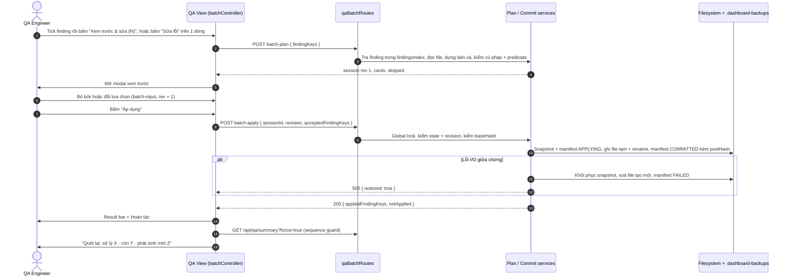

# Kế Hoạch: Xử Lý Hàng Loạt Static Findings (QA Static Findings Batch Fixer)

> **Mã kế hoạch:** `PLAN-18`  
> **Phiên bản:** `v6.2` — thay thế v5 (mục 0); bỏ AI khỏi toàn bộ luồng sửa finding (mục 0.1)  
> **Trạng thái:** `v6.2 — D1–D5 ĐÃ CHỐT · PHASE 0–2 XONG · CONTRACT CHỜ BA DUYỆT HASH (task 0.2) · TIẾP THEO: PHASE 3`  
> **Phạm vi:** View **QA Docs & Automation** (`#/qa`, tab "Vấn đề") — `dashboard/public/templates/qa.html`, `dashboard/public/js/views/qa/`, `dashboard/services/`, `dashboard/routes/`, `tools/qa/lib/sources.js` (thay đổi nhỏ, tương thích ngược).  
> **Tham chiếu bắt buộc:** [AGENTS.md](../AGENTS.md), [DASHBOARD_AI_PROMPT.md](../ai/dashboard/DASHBOARD_AI_PROMPT.md), [AI_LESSONS.md](../ai/dashboard/AI_LESSONS.md), [03_ACCEPTANCE_GATES.md](../.master_process/03_ACCEPTANCE_GATES.md), [gate-scenarios.json](../.master_process/config/gate-scenarios.json).  
> **Nhánh:** trunk-based trên `main`. Mỗi phase chỉ đóng khi toàn bộ exit criteria của phase có bằng chứng chạy thật (mục 9, 10).

---

## 0. Thay Đổi So Với v5 (Lý Do Viết Lại)

v5 được đối chiếu với code thực tế ngày 2026-09-25. Các điểm dưới đây là lỗ hổng đã xác nhận bằng code, không phải giả định.

| # | v5 | Vấn đề đã xác nhận | v6 |
| --- | --- | --- | --- |
| 1 | Fast-Fix `test-khong-co-ma-tc` tự gán `TC - AC` khi có REQ | `drift()` `continue` sau finding này ([commands.js:565-573](../tools/qa/lib/commands.js#L565-L573)) nên sửa TC xong mới lộ `test-thieu-tag-req`, `script-khong-co-trong-test-case`, `test-tro-toi-ac-khong-ton-tai`. Chọn AC là quyết định nghiệp vụ | Tuyến `guided`: người dùng chọn AC. Bản vá gồm title + tag REQ + dòng traceability trong **cùng giao dịch** (Phase 4, tách phát hành được) |
| 2 | Regex riêng `(?<!await\s+)expect…/g` | Lệch scanner; thêm `await` vào cả expect đồng bộ cùng dòng (BATCH-26 v5 tự mâu thuẫn); bỏ sót `[expect(`, `(expect(` | Dùng lại `findMissingAwaits` đã export ([sources.js:317-341](../tools/qa/lib/sources.js#L317-L341)) để định vị đúng occurrence |
| 3 | Không kiểm tra cú pháp sau vá | `await` trong callback không `async` làm `playwright --list` fail, cả gate thành blocker `khong-doc-duoc-playwright` | Parse lại nội dung + kiểm predicate "finding đã hết" **trước khi ghi** |
| 4 | Tuyến AI trong batch; nút "AI Sửa Lỗi" từng dòng | AI ít giá trị, nhiều rủi ro (mục 0.1) | **Bỏ AI khỏi toàn bộ luồng sửa finding.** Batch và nút từng dòng chỉ dùng logic xác định |
| 5 | Gỡ `test.skip` hàng loạt | Scanner bắt cả `test.fixme`; tự chấp nhận `@wip` ([commands.js:473-480](../tools/qa/lib/commands.js#L473-L480)); gỡ skip hàng loạt dễ làm CI đỏ | Mặc định gắn `@wip`; "Kích hoạt lại" là lựa chọn từng mục |
| 6 | Scaffold `REQ-001-general.md` nội dung mẫu | Bịa requirement (AC đăng nhập giả), hardcode `requirements/` | Mở Scaffold modal sẵn có (`openScaffoldModal`) |
| 7 | `ma-tc-trung` → Conflict Studio | Studio chỉ xử lý `ac-lech-giua-tai-lieu-va-spec` ([qaConflictService.js:37](../dashboard/services/qaConflictService.js#L37)) | Tuyến `manual`: mở tài liệu trong Document Reader |
| 8 | Client gửi `findings`/`aiAnalyses`; `apply-fix` nhận snippet từ client | Server ghi nội dung do client cung cấp; trái nguyên tắc "service tính lại từ file thật" ([qaRoutes.js:353-354](../dashboard/routes/qaRoutes.js#L353-L354)) | Client chỉ gửi `findingKey`; server tự dựng bản vá; bỏ `apply-fix` |
| 9 | 2 nút → 2 session (heuristic, AI) | Session áp dụng sau chắc chắn 409 nếu cùng file | 1 nút, 1 session; nút từng dòng dùng chung engine với 1 finding |
| 10 | Mutex theo session; cấp TC lúc plan | Hai session khác nhau vẫn race; hai plan cấp trùng TC | Global write lock theo project root; giữ chỗ TC + kiểm lại trong lock |
| 11 | Rollback không kiểm tra | Đè thay đổi của người dùng/batch khác sau commit | So `postHash`; lệch → 409 + xác nhận ghi đè có sao lưu |
| 12 | Undo 10s, đếm ngược, pause-on-hover | Quá ngắn; không dùng được bằng bàn phím/cảm ứng; "bền qua restart" vô nghĩa trong 10s | Không đếm ngược; "Hoàn tác batch gần nhất" tồn tại tới batch kế tiếp, đọc từ manifest nên sống qua restart |
| 13 | Không nói về EOL/BOM | Ghi `join('\n')` (như [fixer.js](../tools/qa/lib/fixer.js#L99)) đổi cả file CRLF | Giữ nguyên EOL, BOM, newline cuối file |
| 14 | `writeFileSync` tuần tự; manifest ghi `COMMITTED` trước khi ghi file | Process chết giữa chừng không phục hồi được | Ghi file tạm + rename; manifest `APPLYING → COMMITTED`; phục hồi khi khởi động |
| 15 | ID checkbox theo index | Spec desktop thuộc 2 project, mobile 4 project ([defineConfig.js:140-194](../core/config/defineConfig.js#L140-L194)) → cùng finding lặp tới 4 lần, cùng key | Server gộp theo key, badge `×N project`; không cần ID checkbox |
| 16 | Không prune selection | Key chứa số dòng, đổi sau khi file đổi → mục chọn "ma" | Prune sau mỗi lần quét + thông báo |
| 17 | Checkbox trên mọi dòng | Chọn mục không sửa được; mục bị filter ẩn vẫn bị sửa | Chỉ dòng sửa được có checkbox; hiện "M đang ẩn" |
| 18 | Không chống response muộn | `reload()` không có sequence guard ([qaSlice.js:292-349](../dashboard/public/js/views/qa/qaSlice.js#L292-L349)); Apply → Undo nhanh bị kết quả cũ đè | Sequence guard + trạng thái "Đang quét lại" |
| 19 | `AbortController` phía client cho hàng đợi AI | `fetch` tới provider phía server không có `signal` → vẫn tốn token | Không còn lời gọi AI |
| 20 | Không có task test UI/API; thử trên repo thật | Không có bằng chứng; `requirements/`, `test-cases/` của repo đang rỗng | Fixture workspace + service/API/E2E tests + gate receipts |
| 21 | File lớn dùng exemption size-check | Trái policy (service 200, module 250, utils 150 dòng) | Tách module đúng giới hạn, không exemption cho file mới |

### 0.1. Vì sao không dùng AI (đã chốt 2026-09-25)

v6.1 bỏ AI khỏi batch; v6.2 bỏ luôn AI khỏi nút sửa từng dòng.

**Số liệu repo hiện tại** (đếm tĩnh trên `tests/e2e` + `tests/api`: 8 file spec, 10 test): 10 test thiếu `TC-xxx - AC-xxx`, 0 test bị skip, 0 test thiếu assertion, 0 chỗ thiếu `await`.

| Loại finding | Cách sửa đúng | AI thêm được gì |
| --- | --- | --- |
| `assertion-thieu-await`, `test-bi-skip-am-tham` | Quy tắc cố định, cho kết quả chính xác | Không gì — quy tắc đã đúng, AI chỉ thêm rủi ro |
| `test-thieu-tag-req`, `test-khong-co-ma-tc` | Tra dữ liệu có sẵn hoặc người dùng chọn AC | Không được đoán REQ (INV-2). Gợi ý AC tiết kiệm rất ít vì mỗi REQ thường có vài AC và người dùng vẫn phải xác nhận |
| `spec-thieu-assertion` | Cần hiểu kỳ vọng nghiệp vụ của test | AI không biết kỳ vọng nghiệp vụ; bản nháp phải review từng dòng, công sức gần bằng tự viết. Repo hiện có 0 mục |
| `khong-doc-duoc-requirement`, `ma-tc-trung`, các kind còn lại | Quyết định nghiệp vụ / tài liệu | Không nên để AI tự sửa |

**Rủi ro của nút "AI Sửa Lỗi" hiện tại** (đã kiểm trong [qaFindingFixerService.js](../dashboard/services/qaFindingFixerService.js)):

- AI được gọi **trước** cho mọi kind, kể cả các kind đã có quy tắc chính xác; kết quả AI thay thế kết quả quy tắc (dòng 516-524).
- AI tự chọn `targetFile` và `patchType`; `replace_file` ghi đè **cả file** bằng `fullContent`; đường dẫn chỉ bị chặn khi ra ngoài project nên AI vẫn có thể nhắm tới file khác trong repo (dòng 474-483, 579-587).
- Áp dụng bằng `string.replace` ở lần xuất hiện đầu tiên → sửa nhầm dòng khi có dòng trùng (dòng 593-594). Không kiểm tra cú pháp.
- Gửi đoạn mã ±15 dòng ra provider bên ngoài; cần API key, tốn token; kết quả không lặp lại được nên khó kiểm thử (dòng 305-319).
- AI lỗi → âm thầm chuyển sang heuristic sinh bản vá giả: `toHaveTitle(/.+/)`, `@REQ-001`, `TC-xxx:` (dòng 525-534).

**Quyết định:** không dùng AI trong luồng sửa finding.

- Nút từng dòng "Sửa lỗi" (kind `quick`/`guided`) dùng chung engine batch với đúng 1 finding: cùng xem trước, cùng kiểm tra, cùng hoàn tác.
- Kind không sửa tự động được có modal "Chi tiết & hướng dẫn": thông tin finding, hướng dẫn của scanner, đoạn mã quanh dòng lỗi (chỉ đọc), sao chép vị trí.
- Ai cần AI hỗ trợ vẫn dùng tab AI Agent của Dashboard hoặc trợ lý trong IDE — chủ động, ngoài luồng ghi file của QA.
- Lợi ích phụ: bỏ phụ thuộc API key, không cần mock provider, mọi test đều xác định.

---

## 1. Bối Cảnh & Mục Tiêu

### 1.1. Hiện trạng

- Tab "Vấn đề" render `summary.findings` (gộp `gaps()` + `drift()` của [commands.js](../tools/qa/lib/commands.js#L758)) trong `#qa-static-gaps-list`. Mỗi dòng có nút "AI Sửa Lỗi" mở modal sửa từng lỗi (`findingFixerHelper.js` → `/api/qa/finding/ai-analyze-fix` → `/api/qa/finding/apply-fix`).
- Sửa từng lỗi chậm khi có hàng chục finding; luồng AI hiện tại có các rủi ro ở mục 0.1.
- **Lỗi chặn đã sửa (2026-09-25, task 0.0):** `playwright --list` lỗi `Test has unknown parameter "ephemeralUser"` nên scanner đọc được 0 test. Nguyên nhân: vòng `require` giữa `core/fixtures/baseTest.js` và `core/fixtures/custom/index.js` (từ commit `7f01158`). Sau khi sửa, scanner đọc được 12 test và báo 13 finding (1 `khong-doc-duoc-requirement`, 12 `test-khong-co-ma-tc`).

### 1.2. Mục tiêu đo được

- **G1:** Chọn nhiều finding sửa được → 1 lần xem trước → 1 lần áp dụng → hoàn tác được toàn bộ. Sửa 1 finding đi cùng đường đó.
- **G2:** Không bản vá nào làm hỏng cú pháp spec hoặc ghi REQ/AC/TC không suy ra được.
- **G3:** Không ghi đè thay đổi của người khác, cả lúc apply lẫn rollback.
- **G4:** Lập kế hoạch cho ≤ 100 finding `quick` trong ≤ 2s (chỉ đọc file, không chạy `playwright --list`); apply ≤ 2s cho ≤ 30 file.
- **G5:** Sau apply, người dùng thấy "đã xử lý / còn lại / phát sinh mới" dựa trên lần quét lại thật.
- **G6:** Luồng sửa finding không gọi bất kỳ AI provider nào.

### 1.3. Ngoài phạm vi

- Dùng AI trong luồng sửa finding (mục 0.1).
- Sửa tự động `spec-thieu-assertion`, `ma-tc-trung`, `rule-thieu-boundary-test` và mọi kind không có route `quick`/`guided` ở mục 4 (chỉ hướng dẫn/điều hướng).
- Title test/describe viết trên nhiều dòng → skip có lý do (`TITLE_NOT_ON_LINE`).
- Điều phối với các trình ghi file khác của Dashboard (spec editor, Page Manager) ngoài việc phát hiện qua hash.
- Chuyển `getQaSummary` sang bất đồng bộ (ghi nhận ở mục 12).
- Sửa lỗi `playwright --list` (commit riêng, là điều kiện tiên quyết ở Phase 0).

---

## 2. Ràng Buộc Từ Code Hiện Tại (Ground Truth)

1. `where` của finding cấp test là `path:line` của **dòng khai báo test** ([commands.js:38-40](../tools/qa/lib/commands.js#L38-L40)); `assertion-thieu-await` là `path:line` của dòng `expect`; `khong-doc-duoc-requirement` là `requirements/`; `ma-tc-trung` là danh sách nhiều file.
2. Một test thiếu TC không bao giờ đồng thời bị báo thiếu REQ (`continue`); sau khi có TC mới lộ các finding truy vết ([commands.js:574-604](../tools/qa/lib/commands.js#L574-L604)).
3. `isSkipped` = dòng khai báo chứa `test.skip`/`test.fixme` ([sources.js:462](../tools/qa/lib/sources.js#L462)); finding tắt khi test có tag `@wip`.
4. `reqId` lấy từ `spec.tags` (gồm tag trong title và tag kế thừa từ describe), chỉ nhận đúng `@REQ-\d{3}` ([sources.js:484-485](../tools/qa/lib/sources.js#L484-L485)). `RE_TC_AC_TITLE = /^(TC-\d{3})\s*-\s*(AC-\d{3})\b/` ([sources.js:37](../tools/qa/lib/sources.js#L37)) → tối đa `TC-999`.
5. `findMissingAwaits`, `ASYNC_MATCHERS`, `loadRequirements`, `loadTestCases` đã được export ([sources.js:534-541](../tools/qa/lib/sources.js#L534-L541)); `findMissingAwaits` đã xử lý `.not/.resolves/.rejects`, `return/yield`, expect nhiều dòng.
6. `getQaSummary` chạy đồng bộ in-process, `playwright --list` qua `execFileSync` (~5s), cache 60s ([qaService.js:577-605](../dashboard/services/qaService.js#L577-L605)) → event loop bị chặn trong lúc quét.
7. Đã có sẵn: Auto-Fix `/api/qa/fix` ([fixer.js](../tools/qa/lib/fixer.js) — thêm dòng traceability `them-test-case-chua-khai-bao`), Scaffold modal requirement, Conflict Studio, Document Reader, tab AI Agent.
8. Luồng sửa từng dòng hiện tại gồm: `findingFixerHelper.js`, `#qa-finding-fix-modal` trong `qa.html`, route `ai-analyze-fix` + `apply-fix` trong `qaRoutes.js`, `qaFindingFixerService.js`; có test tại `qaFindingFixerService.test.js` và `tests/dashboard-api/qa.test.js` (dòng 481).
9. Spec là CommonJS (`require`); `package.json` không khai `"type": "module"`.
10. Test harness có sẵn: `tests/dashboard/support/dashboardHarness.js`, `fixtureWorkspace.js`; API test dùng `node:test` trong `tests/dashboard-api/`.
11. Giới hạn modularity: service 200, module 250, utils/component 150 dòng ([modularity_audit.py:25](../.master_process/scripts/modularity_audit.py#L25)).
12. Repo này có `requirements/` và `test-cases/` rỗng → mọi kiểm thử cần ngữ cảnh REQ phải chạy trên fixture workspace.

---

## 3. Nguyên Tắc Bất Biến (Invariants)

- **INV-1 — Server là nguồn sự thật:** client chỉ gửi `findingKey`, `sessionId`, `revision` và lựa chọn của người dùng. Server không ghi nội dung do client cung cấp.
- **INV-2 — Không bịa truy vết:** REQ/AC/TC chỉ được ghi khi suy ra **duy nhất** từ dữ liệu có sẵn hoặc do người dùng chọn. Nếu không → `skipped` kèm `reasonCode`.
- **INV-3 — Không ghi nội dung hỏng:** mỗi file sau vá phải parse được và predicate "finding đã hết" phải đúng trên nội dung mới trước khi ghi đĩa.
- **INV-4 — Không đè thay đổi của người khác:** apply kiểm `baseHash`, rollback kiểm `postHash`.
- **INV-5 — Một implementation:** sửa 1 finding và sửa hàng loạt đi qua cùng một engine.
- **INV-6 — Giữ nguyên định dạng file:** EOL (CRLF/LF), BOM, có/không newline cuối file.
- **INV-7 — Một cửa ghi:** mọi thao tác ghi của batch và `/api/qa/fix` đi qua cùng một write lock theo project root.
- **INV-8 — Xác định:** cùng input cho cùng bản vá; luồng sửa finding không gọi AI provider.

---

## 4. Phân Tuyến Theo Loại Finding (Routing Catalog)

Nguồn sự thật duy nhất: `dashboard/services/qaFindingCatalog.js`. Server gắn `fixRoute` vào từng finding; UI không tự suy luận route.

| Kind | Route | Transform | Skip khi (`reasonCode`) | Tick mặc định |
| --- | --- | --- | --- | --- |
| `assertion-thieu-await` | `quick` | Chèn từ khoá `await` đúng cột của `expect` mà `findMissingAwaits` trả về tại dòng finding | `ALREADY_FIXED` (không còn occurrence), `IN_EXPRESSION` (ký tự khác trắng liền trước là `[`, `(`, `,`), `SYNTAX_INVALID`, `SCANNER_UNAVAILABLE` (satellite chưa có `tools/qa` bản có `column`) | Có |
| `test-bi-skip-am-tham` | `quick` | Mặc định **thêm `@wip`** vào cuối title. Lựa chọn từng mục "Kích hoạt lại": `test.skip(`/`test.fixme(` → `test(` (chỉ dạng khai báo `test.skip('…'`) | `TITLE_NOT_ON_LINE`, `TEMPLATE_TITLE`, `CONDITIONAL_SKIP` | Có (`@wip`) |
| `test-thieu-tag-req` | `quick` | Thêm `@REQ-xxx` vào cuối title của `test.describe` bao quanh test ([AI_PROMPTS.md](../ai/shared/AI_PROMPTS.md) 3.3); test không nằm trong describe thì thêm vào title test. REQ lấy từ (1) bảng traceability theo `tcId` của test, (2) tên file chứa `REQ-\d{3}`; REQ phải tồn tại trong `loadRequirements`. Mọi test trong describe phải chưa có REQ hoặc cùng REQ đó | `REQ_UNKNOWN`, `REQ_AMBIGUOUS` (2 nguồn khác nhau), `REQ_NOT_FOUND`, `DESCRIBE_MIXED_REQ`, `DESCRIBE_NOT_RESOLVED`, `TITLE_NOT_ON_LINE`, `TEMPLATE_TITLE` | Có |
| `test-khong-co-ma-tc` | `guided` (Phase 4; trước đó là `manual`) | Người dùng chọn AC → title `TC-NNN - AC-NNN <mô tả>` (AI_PROMPTS 3.3) + `@REQ` lên describe nếu thiếu (cùng quy tắc trên) + dòng traceability trong file test-cases của REQ | `REQ_UNKNOWN`, `NO_TRACEABILITY_TABLE`, `TC_OVERFLOW` (> 999), `TITLE_NOT_ON_LINE` | **Không** (cần chọn AC) |
| `spec-thieu-assertion` | `manual` | "Xem hướng dẫn": đoạn mã quanh test + hướng dẫn của scanner; người dùng tự viết assertion | — | Không có checkbox |
| `khong-doc-duoc-requirement` | `scaffold` | Nút "Tạo requirement" mở `#qa-scaffold-modal` sẵn có | — | Không có checkbox |
| `script-khong-co-trong-test-case` | `autofix` | Nút "Chuẩn hoá traceability" mở Auto-Fix sẵn có (dry-run) | — | Không có checkbox |
| `ma-tc-trung` | `manual` | Nút "Mở tài liệu" → Document Reader tại file đầu tiên trong `where` | — | Không có checkbox |
| Mọi kind khác | `manual` | "Xem hướng dẫn": hiển thị `action` của scanner + đoạn mã liên quan | — | Không có checkbox |

**Định vị title:** title phải là chuỗi literal đầu tiên của lời gọi `test` / `test.skip` / `test.fixme` / `test.only` trên dòng finding, hỗ trợ quote lồng và ký tự escape. Template literal chứa `${` → `TEMPLATE_TITLE`. Chèn tag có tính idempotent: tag đã có thì trả `ALREADY_FIXED`.

**Định vị describe:** dòng `test.describe(` gần nhất phía trên có thụt lề nhỏ hơn dòng test; phạm vi describe kết thúc ở dòng đầu tiên phía dưới có thụt lề ≤ thụt lề describe. Không xác định được → `DESCRIBE_NOT_RESOLVED`. Nhiều finding `test-thieu-tag-req` cùng một describe sinh cùng một bản vá; modal hiện 1 dòng liệt kê các finding đó, tick một lần áp dụng cho tất cả.

---

## 5. Kiến Trúc

### 5.1. Luồng tổng



### 5.2. Danh mục file

#### Backend

| File | Loại | Nội dung |
| --- | --- | --- |
| `tools/qa/lib/sources.js` | sửa (Hub) | `findMissingAwaits` trả thêm `column` (vị trí `expect` trong dòng). Tương thích ngược |
| `dashboard/services/qaFindingCatalog.js` | mới, utils ≤150 | `createFindingKey`, `createMatchKey`, `routeFor`, `enrichFindings` (gộp trùng, `occurrences`, `fixRoute`) |
| `dashboard/services/qaService.js` | sửa | `getQaSummary` trả finding đã enrich + `scanId`; giữ `findingsIndex` (Map theo root, không phụ thuộc TTL cache) |
| `dashboard/services/qaFixText.js` | mới, utils ≤150 | `parseDocument` / `serializeDocument` (BOM, EOL từng dòng, newline cuối), `replaceLine`, `insertLines`, `hashNormalized`, `insertAtColumn`, `indentOf` |
| `dashboard/services/qaFixTitle.js` | mới, utils ≤150 | `locateTitle`, `titleTags`, `appendTitleTag`, `unskipDeclaration`, `locateEnclosingDescribe`, `reqTagsInRange` |
| `dashboard/services/qaFixValidate.js` | mới, utils ≤150 | `validateSyntax`, `findMissingAwaitAt`, `isResolved` theo kind, `scannerAvailable` (nạp mềm `tools/qa`; thiếu → tuyến await tự tắt) |
| `dashboard/services/qaBatchSessionStore.js` | mới, utils ≤150 | Session Map, TTL, state machine, `withWriteLock(root, fn)` |
| `dashboard/services/qaQuickFixes.js` | mới, utils ≤150 | 3 planner quick (`planFinding`) + `loadReqContext` (REQ hợp lệ, map TC → REQ) |
| `dashboard/services/qaBatchManifest.js` | mới, utils ≤150 | Đường dẫn snapshot/pre-rollback, đọc/ghi manifest, `writeAtomic` (tạm + rename, retry EPERM/EBUSY) |
| `dashboard/services/qaBatchPlanService.js` | mới, service ≤200 | `buildPlan`, `applyInput`, `composeForCommit` (hunk + 2 dòng ngữ cảnh) |
| `dashboard/services/qaBatchCommitService.js` | mới, service ≤200 | `commit`, `writeAtomic`, manifest |
| `dashboard/services/qaBatchRollbackService.js` | mới, service ≤200 | `rollback`, `getLatestCommitted`, `recoverInterrupted`, `pruneBackups` |
| `dashboard/services/qaFindingFixerService.js` | rút gọn, utils ≤150 | Chỉ còn `resolveSafePath` + `getFindingContext` (đoạn mã ±15 dòng). Xoá `analyzeFindingFix`, `analyzeWithAiFix`, `analyzeWithHeuristicFix`, `applyFindingFix`, import `parseEnvFile` và header exemption |
| `dashboard/routes/qaBatchRoutes.js` | mới, module ≤250 | 6 endpoint mục 5.4; đăng ký trong `dashboard/server.js` cạnh `handleQaRoutes` |
| `dashboard/routes/qaRoutes.js` | sửa | Xoá route `ai-analyze-fix` và `apply-fix`; `/api/qa/fix` đi qua `withWriteLock` |

#### Frontend (`dashboard/public/js/views/qa/`)

| File | Loại | Nội dung |
| --- | --- | --- |
| `batch/selectionModel.js` | utils ≤150, thuần | Set key, `toggle`, `prune`, `visibleState`, `toggleVisible`, `counts`, `hiddenCount` |
| `batch/batchController.js` | module ≤250 | Điều phối; trạng thái `idle / planning / reviewing / applying / rollingBack`; sở hữu disposers; `fixOne(findingKey)` cho nút từng dòng |
| `batch/batchToolbar.js` | component ≤150 | Master checkbox, chip, bộ đếm, nút chính, "Hoàn tác batch gần nhất" |
| `batch/batchPreviewModal.js` | module ≤250 | Modal, tick từng bản vá, lựa chọn, banner skipped, lỗi |
| `batch/batchDiffView.js` | component ≤150 | Diff có số dòng, dựng bằng `textContent`, màu theo token |
| `batch/batchResultBar.js` | component ≤150 | Kết quả, thống kê quét lại, hoàn tác, xác nhận khi rollback xung đột |
| `findingDetailModal.js` | mới, component ≤150 | Thay `findingFixerHelper.js`: modal "Chi tiết & hướng dẫn" (thông tin finding, `action`, đoạn mã chỉ đọc, sao chép vị trí); không có nút áp dụng |
| `findingFixerHelper.js` | xoá | Thay bằng `findingDetailModal.js` + `batchController.fixOne` |
| `qaSlice.js` | sửa tối thiểu | Tạo/huỷ controller trong `mount`/`unmount`; `reload()` có sequence guard + `scanPending`; `renderFindings()` giao cột chọn/hành động cho controller; event delegation trên `#qa-static-gaps-list` |
| `templates/qa.html`, `styles/views/qa.css` | sửa | Markup toolbar, `#qa-batch-modal`, `#qa-batch-result-bar`; thay `#qa-finding-fix-modal` (tiêu đề "AI Copilot…", badge AI) bằng `#qa-finding-detail-modal`; style dùng token, không inline style, không màu hex |

### 5.3. Dữ liệu finding sau khi enrich

```json
{
  "findingKey": "a1b2c3d4e5f60718",
  "matchKey": "9f8e7d6c5b4a3921",
  "kind": "assertion-thieu-await",
  "severity": "major",
  "where": "tests/e2e/desktop/login.spec.js:57",
  "message": "…",
  "action": "…",
  "label": "…",
  "fixRoute": "quick",
  "occurrences": 2
}
```

- `findingKey = sha1(kind | normalizePath(where || id) | (message || detail)).slice(0, 16)` — chỉ tính ở server (trình duyệt truy cập qua HTTP trong LAN không có `crypto.subtle`).
- `matchKey = sha1(kind | path không kèm số dòng | message)` — dùng để so sánh trước/sau khi quét lại, không bị lệch khi số dòng dịch chuyển.
- Gộp trùng theo `findingKey`, `occurrences` = số lần xuất hiện qua các Playwright project.
- `summary.scanId` chỉ tăng khi quét thật (không tăng khi trả từ cache).

### 5.4. API (`dashboard/routes/qaBatchRoutes.js`)

**Quy ước mã trạng thái** (theo [test-conventions.md](../.ai/knowledge/qa/test-conventions.md)): 200 cho mọi xử lý hoàn tất, kể cả có `skipped`; 400 body sai; 403 đường dẫn vi phạm; 404 `SESSION_NOT_FOUND` | `FINDING_NOT_FOUND`; 409 `BATCH_LOCKED` | `INVALID_STATE` | `REVISION_STALE` | `STALE_FILES` | `ROLLBACK_CONFLICT` | `NOT_LATEST_BATCH`; 500 chỉ khi lỗi I/O, kèm `restored: true|false`. Body lỗi: `{ error, code, details? }`.

| Endpoint | Body | Trả về |
| --- | --- | --- |
| `POST /api/qa/finding/batch-plan` | `{ findingKeys: string[] }` (1..200) | `{ ok, session: { sessionId, revision, expiresAt }, cards, skipped, totals }` |
| `POST /api/qa/finding/batch-input` | `{ sessionId, revision, findingKey, input: { skipMode: 'wip' \| 'unskip' } \| { acId } }` | `{ ok, revision, card, skipped? }` |
| `POST /api/qa/finding/batch-apply` | `{ sessionId, revision, acceptedFindingKeys: string[] }` | `{ ok, sessionId, appliedFindingKeys, notApplied: [{ findingKey, reasonCode }], files: [{ relPath, action }] }` |
| `POST /api/qa/finding/batch-rollback` | `{ sessionId, forceFiles?: string[] }` | `{ ok, restoredFiles, removedFiles, alreadyRolledBack }`; xung đột → 409 `ROLLBACK_CONFLICT` với `details.files` |
| `GET /api/qa/finding/batch-last` | — | `{ ok, latest: { sessionId, status, committedAt, files, appliedCount } \| null }` |
| `GET /api/qa/finding/context?findingKey=…` | — | `{ ok, finding, file: { relPath, startLine, lines: string[] } \| null }` — chỉ đọc, cho modal "Chi tiết & hướng dẫn" |

- `FileCard = { relPath, action: 'modified' | 'created', patches: [{ findingKey, kind, line, risk: 'low' | 'behavior' | 'traceability', defaultSelected, choice?, hunk: { startLine, before: string[], after: string[] } }] }`.
- `Skipped = { findingKey, kind, where, reasonCode, reason, nextAction?: { type: 'scaffold' | 'autofix' | 'openDoc' | 'detail', target? } }`.
- `baseHash`, `postHash`, nội dung file đầy đủ không gửi về client.
- Giới hạn body 64KB (chỉ key và lựa chọn).

### 5.5. Session, lock và giữ chỗ TC

- **State machine:** `PLANNED → APPLYING → COMMITTED → ROLLING_BACK → ROLLED_BACK`; `APPLYING → FAILED`; `PLANNED → EXPIRED` (TTL 15 phút). Chuyển trạng thái sai → 409 `INVALID_STATE`.
- **Revision:** tăng sau mỗi thay đổi nội dung plan (`batch-input`). Apply với revision cũ → 409 `REVISION_STALE`.
- **Store:** RAM, tối đa 20 session `PLANNED`, dọn session hết hạn khi có request (không dùng `setInterval` phía server).
- **Write lock:** một lock theo project root cho `batch-apply`, `batch-rollback`, `/api/qa/fix`. Đang bận → 409 `BATCH_LOCKED` ngay, không xếp hàng.
- **Giữ chỗ TC (Phase 4):** `max` = TC trong `loadTestCases().links` ∪ TC trong title spec (từ `collect()` của lần lập plan) ∪ TC đang giữ chỗ ở session `PLANNED` khác. Trong lock lúc apply: đọc lại bảng traceability và title của các spec đã biết; nếu trùng → 409 `STALE_FILES` với lý do `TC_TAKEN`.

### 5.6. Kiểm tra cú pháp và predicate (`qaFixValidate.js`)

- **`.js`/`.cjs`:** `new vm.Script('(function (exports, require, module, __filename, __dirname) {' + code + '\n})', { filename })` — chỉ compile, không chạy.
- **`.mjs` hoặc file có `import` ở top-level:** `node --check` trên file tạm trong `.dashboard-drafts/qa-batch/<sessionId>/` với `windowsHide: true`.
- **`.md` (Phase 4):** chạy `loadTestCases` trên bản sao trong `.dashboard-drafts/qa-batch/<sessionId>/`; link `(REQ, AC, TC)` mới phải xuất hiện đúng 1 lần.
- **Predicate theo kind:** `findMissingAwaits` không còn occurrence tại dòng; title có tag cần thêm; dòng khai báo không còn `skip`/`fixme` hoặc title có `@wip`; title khớp `RE_TC_AC_TITLE`.

### 5.7. Commit (`batch-apply`)

1. Lấy write lock (bận → 409 `BATCH_LOCKED`).
2. Session phải `PLANNED` và `revision` khớp; chuyển sang `APPLYING`.
3. Stale check: file `modified` → hash nội dung đã chuẩn hoá EOL phải bằng `baseHash`; file `created` → chưa tồn tại. Lệch → 409 `STALE_FILES` (liệt kê file), session về `PLANNED`.
4. Dựng nội dung cuối: áp các bản vá được tick theo thứ tự dòng giảm dần trên mảng dòng; khôi phục EOL/BOM/newline cuối; chạy lại mục 5.6. File nào không đạt → loại khỏi lần ghi và đưa vào `notApplied` (chưa có gì được ghi).
5. Tạo `.dashboard-backups/qa-batch/<sessionId>/`: chép file `modified` vào snapshot; ghi `manifest.json` với `status: "APPLYING"`.
6. Mỗi file: ghi `<file>.qa-batch-tmp` cùng thư mục rồi `fs.renameSync` (Windows `EPERM`/`EBUSY` → thử lại 3 lần, cách 50ms); ghi `postHash` vào manifest.
7. Lỗi bất kỳ ở bước 6 → khôi phục các file đã ghi từ snapshot, xoá file `created`, xoá file tạm, manifest `FAILED`, trả 500 `{ restored: true }`.
8. Manifest `COMMITTED`; `invalidateQaSummaryCache()`; nhả lock; trả 200.

```json
{
  "sessionId": "qb-20260925-8f3a",
  "status": "COMMITTED",
  "createdAt": "2026-09-25T09:12:03.120Z",
  "committedAt": "2026-09-25T09:12:04.004Z",
  "appliedFindingKeys": ["a1b2c3d4e5f60718"],
  "files": [
    { "relPath": "tests/e2e/desktop/login.spec.js", "action": "modified", "snapshotRel": "files/tests/e2e/desktop/login.spec.js", "baseHash": "…", "postHash": "…" },
    { "relPath": "test-cases/REQ-002-cart.md", "action": "modified", "snapshotRel": "files/test-cases/REQ-002-cart.md", "baseHash": "…", "postHash": "…" }
  ]
}
```

### 5.8. Rollback, phục hồi và dọn dẹp

- **Rollback:** lấy lock → nạp session từ RAM hoặc `manifest.json` → `ROLLED_BACK` thì trả 200 `alreadyRolledBack` → chỉ cho phép session `COMMITTED` **mới nhất** (không thì 409 `NOT_LATEST_BATCH`) → so hash hiện tại với `postHash`: lệch mà file không có trong `forceFiles` → 409 `ROLLBACK_CONFLICT`. File trong `forceFiles`: sao lưu bản hiện tại vào `pre-rollback/` trước khi khôi phục → khôi phục `modified` (file tạm + rename), xoá `created` → manifest `ROLLED_BACK` → invalidate cache.
- **Phục hồi:** request batch đầu tiên sau khi server khởi động quét các manifest `APPLYING` → khôi phục từ snapshot, xoá file tạm → `RECOVERED`. `batch-last` báo trạng thái này để UI thông báo.
- **Dọn dẹp:** sau mỗi commit, giữ 20 session gần nhất hoặc 7 ngày, xoá phần còn lại trong `.dashboard-backups/qa-batch/`.

---

## 6. Thiết Kế UI/UX

### 6.1. Toolbar và hành động trên từng dòng

```text
┌────────────────────────────────────────────────────────────────────────────────────────┐
│ [▣] 5 đã chọn · 2 đang ẩn  Bỏ chọn             [Tất cả 11] [Sửa nhanh 4] [Xử lý tay 7] │
│                                       [ph-arrow-counter-clockwise Hoàn tác batch gần nhất] │
│                                                    [ph-lightning Xem trước & sửa (5)]       │
└────────────────────────────────────────────────────────────────────────────────────────┘
```

**Hành động trên từng dòng** (thay nút "AI Sửa Lỗi"):

| Route | Checkbox | Nút chính | Nút phụ |
| --- | --- | --- | --- |
| `quick`, `guided` | Có | "Sửa lỗi" → modal xem trước với đúng finding này | "Chi tiết" |
| `scaffold` | Không | "Tạo requirement" | "Chi tiết" |
| `autofix` | Không | "Chuẩn hoá traceability" | "Chi tiết" |
| `manual` | Không | "Xem hướng dẫn" (modal "Chi tiết & hướng dẫn"); `ma-tc-trung` thêm "Mở tài liệu" | — |

- Dòng gộp trùng có badge `×N project`.
- **Master checkbox** tính trên các dòng đang hiển thị **và** có checkbox: 0 → unchecked; một phần → `indeterminate`; tất cả → checked. Click khi unchecked/indeterminate → chọn tất cả dòng đang hiển thị; khi checked → bỏ chọn các dòng đó. Không đụng mục bị filter ẩn.
- **"M đang ẩn"** hiện khi có mục đã chọn nằm ngoài filter; bấm vào để chuyển về "Tất cả". Link "Bỏ chọn" có tooltip "Bỏ chọn tất cả N mục, kể cả mục đang ẩn".
- **Nút chính "Xem trước & sửa (N)":** N = số mục đã chọn trên mọi filter. Disabled khi N = 0, khi `scanPending` hoặc khi đang có thao tác batch; `title` nói rõ lý do.
- **`scanPending`:** toolbar hiện "Đang quét lại…" kèm spinner; checkbox và nút "Sửa lỗi" tạm khoá để không thao tác trên dữ liệu cũ.
- **Chip:** "Tất cả", "Sửa nhanh", "Cần chọn AC" (từ Phase 4), "Xử lý tay"; đếm trên dòng đã gộp trùng; `aria-pressed` cho chip đang chọn.
- Không có finding sửa được → ẩn nút chính, hiện "Không có mục sửa tự động được".

### 6.2. Vòng đời selection

- State nằm ngoài DOM (`selectionModel`); khi render dòng: `checked = model.has(findingKey)`.
- Sau mỗi summary mới: `model.prune(currentKeys)`. Có mục bị loại → dòng thông báo nhỏ trong toolbar "3 mục đã chọn không còn trong kết quả quét mới".
- Sau apply: bỏ `appliedFindingKeys` khỏi selection, giữ mục `notApplied` và mục không được tick trong modal.
- Sau rollback thành công: chọn lại các key đã áp dụng của batch đó nếu chúng xuất hiện lại sau khi quét.
- "Sửa lỗi" trên 1 dòng không thay đổi selection hiện có.

### 6.3. Modal xem trước `#qa-batch-modal`

```text
┌ Xem trước bản vá ────────────────────────────────────────────────────────────── [✕] ┐
│ 6 bản vá · 2 file · 2 bỏ qua                   Tự động snapshot trước khi ghi       │
├──────────────────────────────────────────────────────────────────────────────────────┤
│ ⚠ 2 mục bị bỏ qua ▸                                                                  │
│   • cart.spec.js:17 — Không xác định được REQ của test (REQ_UNKNOWN)  [Chi tiết]     │
├──────────────────────────────────────────────────────────────────────────────────────┤
│ ▾ [■] tests/e2e/desktop/login.spec.js                         2/2 bản vá   +2 −2     │
│     [■] Thiếu await · dòng 57                                                        │
│          56    await page.fill('#pw', pw);                                           │
│          57  − expect.soft(page.locator('#login-btn')).toBeVisible();                │
│          57  + await expect.soft(page.locator('#login-btn')).toBeVisible();          │
│     [■] Test bị skip · dòng 80    (•) Cách ly bằng @wip   ( ) Kích hoạt lại ⚠        │
│ ▸ [■] tests/e2e/mobile-web/cart.spec.js                       4/4 bản vá   +4 −4     │
├──────────────────────────────────────────────────────────────────────────────────────┤
│ [Huỷ]                                                  [Áp dụng 6 bản vá (2 file)]   │
└──────────────────────────────────────────────────────────────────────────────────────┘
```

- **Primitive:** `.app-modal` / `.app-modal-box` / `.app-modal-body`; độ rộng đặt ở ngoài (`width: min(1040px, 94vw)`); ≤ 600px thì full-screen.
- Mở từ nút "Sửa lỗi" trên 1 dòng: cùng modal, chỉ 1 card; nếu finding bị skip thì modal chỉ hiện lý do + nút "Chi tiết".
- **Tick theo từng bản vá** (theo `findingKey`); checkbox file là tri-state của các bản vá trong file.
- **Badge rủi ro:** "Đổi hành vi" (kích hoạt lại test), "Truy vết" (guided). Bản vá guided mặc định không tick.
- **Đổi lựa chọn** (chế độ skip, AC) → `batch-input` → card cập nhật. Trong lúc chờ: card mờ, nút Apply disabled.
- **Diff:** có số dòng, 2 dòng ngữ cảnh, dựng bằng `textContent`. Có trên 5 file thì thẻ file thu gọn mặc định.
- **Banner skipped:** nhóm theo `reasonCode`, mỗi mục có nút `nextAction` (mở Scaffold, Auto-Fix, tài liệu, hoặc "Chi tiết").
- **Apply** disabled khi 0 bản vá được tick hoặc đang cập nhật revision. Khi đang apply: spinner, khoá ✕/Esc (chặn sự kiện `cancel` của `<dialog>`), khoá mọi checkbox, chỉ 1 request.
- **Đóng modal khi đã có lựa chọn chưa áp dụng** (bỏ tick, đổi chế độ skip, chọn AC) → xác nhận "Bỏ các lựa chọn đã thay đổi?".
- **Lỗi:**
  - 409 `STALE_FILES` / `REVISION_STALE`, 404 `SESSION_NOT_FOUND` → banner đỏ trong modal liệt kê file + nút "Lập lại kế hoạch" (gọi lại `batch-plan` với các key đang tick).
  - 409 `BATCH_LOCKED` → "Đang có thao tác ghi khác. Thử lại sau vài giây." + nút Thử lại.
  - 500 `restored: true` → "Ghi đĩa lỗi, đã khôi phục nguyên trạng. Không file nào bị thay đổi."
- **Focus:** mở modal thì focus vào tiêu đề; đóng thì trả focus về nút đã mở modal.

### 6.4. Modal "Chi tiết & hướng dẫn" `#qa-finding-detail-modal`

- Nội dung: mức độ, nhãn kind, vị trí (`where`) kèm nút sao chép, `message`, `action` của scanner, đoạn mã ±15 dòng quanh vị trí lỗi (chỉ đọc, dòng lỗi được đánh dấu, lấy từ `GET /api/qa/finding/context`).
- Không có nút áp dụng. Với route `quick`/`guided` có thêm nút "Sửa lỗi" chuyển sang modal xem trước.
- Trạng thái: đang tải (skeleton), không có file (chỉ hiện thông tin + hướng dẫn), lỗi (thông báo + thử lại).
- Dùng `.app-modal` primitives; nội dung dựng bằng `textContent`.

### 6.5. Result bar `#qa-batch-result-bar`

```text
┌ ✓ Đã áp dụng 5 bản vá trên 3 file.   Quét lại: xử lý 5 · còn 0 · phát sinh mới 1 ▸   [Hoàn tác] [✕] ┐
```

- `role="status"`, `aria-live="polite"`. Hiện ngay khi `batch-apply` trả 200, không đợi quét lại; phần "Quét lại…" cập nhật khi summary mới về (so multiset `matchKey` của các file đã sửa, trước và sau).
- **Không đếm ngược.** Đóng thanh không làm mất khả năng hoàn tác: toolbar có "Hoàn tác batch gần nhất" (từ `batch-last`, sống qua reload và restart) cho tới khi có batch mới được commit.
- "phát sinh mới N ▸" lọc danh sách về các finding mới để người dùng thấy cascade.
- Hoàn tác: nút chuyển "Đang hoàn tác…". Gặp 409 `ROLLBACK_CONFLICT` → dialog liệt kê file đã bị sửa sau batch: "Hoàn tác sẽ ghi đè các thay đổi này (bản hiện tại được sao lưu vào `.dashboard-backups`)." — [Huỷ] [Vẫn hoàn tác].

### 6.6. Responsive, theme, accessibility

- ≥ 1280px: toolbar 1 hàng; 768–1279px: 2 hàng; ≤ 480px: chip cuộn ngang, nút chính full-width, result bar dính đáy view; cột hành động của dòng xuống dưới nội dung.
- Icon Phosphor (`ph-lightning`, `ph-wrench`, `ph-info`, `ph-arrow-counter-clockwise`), không dùng emoji trong control.
- Màu qua token (`--success`, `--warning`, `--danger`, `--accent`, `--line`, `--surface-2`); kiểm cả Light và Dark.
- Bàn phím: Tab tới master checkbox, chip, dòng, nút; Space để tick; Esc đóng modal (trừ khi đang apply). Checkbox nằm trong `label` với tên `Chọn: {nhãn kind} tại {where}`.
- Event delegation: 1 listener `change` và 1 listener `click` trên `#qa-static-gaps-list` (theo lesson 2026-09-24), không gắn listener cho từng dòng.

---

## 7. Ma Trận Rủi Ro → Rào Chắn → Bằng Chứng

| # | Rủi ro | Rào chắn | Scenario |
| --- | --- | --- | --- |
| R1 | Bịa REQ/AC/TC | INV-2; `skipped` + `reasonCode`; guided bắt buộc chọn AC | BATCH-11, 13, 40 |
| R2 | Sửa xong sinh finding mới (cascade) | Guided vá title + tag + traceability cùng giao dịch; result bar báo "phát sinh mới" | BATCH-35, 40 |
| R3 | Bản vá làm hỏng cú pháp | `qaFixValidate` trước khi ghi | BATCH-08 |
| R4 | Lệch logic scanner | Dùng `findMissingAwaits` + `column` | BATCH-04..07 |
| R5 | Bản vá giả / AI sửa sai / ghi đè cả file | INV-8: không AI; xoá `ai-analyze-fix`, `apply-fix`; nút từng dòng dùng chung engine | BATCH-44, 45 |
| R6 | Kích hoạt test hàng loạt làm CI đỏ | Mặc định `@wip` | BATCH-10 |
| R7 | Trùng dòng / lệch dòng | Vá trên mảng dòng theo thứ tự giảm dần, định vị theo cột | BATCH-01, 02 |
| R8 | Chạy lại sinh `await await` | Predicate `ALREADY_FIXED` | BATCH-03 |
| R9 | Đổi EOL/BOM | `detectFormat` + `fromLines` | BATCH-09 |
| R10 | File đổi giữa lúc plan và apply | `baseHash` → 409 `STALE_FILES` | BATCH-16, 19 |
| R11 | Race khi apply | State machine + write lock | BATCH-18 |
| R12 | Ghi dở dang | File tạm + rename, khôi phục, phục hồi khi khởi động | BATCH-20, 21 |
| R13 | Rollback đè thay đổi sau batch | `postHash` + xác nhận + sao lưu | BATCH-23 |
| R14 | Mất khả năng hoàn tác | Manifest + `batch-last` | BATCH-25, 35 |
| R15 | Client gửi dữ liệu cũ/giả | Chỉ gửi key; server tra `findingsIndex` | BATCH-14, 26 |
| R16 | Finding trùng qua project | Gộp ở server | BATCH-12 |
| R17 | Selection "ma" / bị ẩn | Prune + "M đang ẩn" | BATCH-29, 31 |
| R18 | Response muộn | `revision`; sequence guard trong `reload()` | BATCH-17, 36 |
| R19 | Rò listener | Disposers, delegation, không timer đếm ngược | BATCH-37, 38 |
| R20 | Snapshot tích tụ | Retention 20 session / 7 ngày | BATCH-28 |
| R21 | Hai session cấp trùng TC | Giữ chỗ + kiểm lại trong lock | BATCH-41 |
| R22 | TC vượt 999 | `TC_OVERFLOW` | BATCH-42 |

---

## 8. Chiến Lược Kiểm Thử

### 8.1. Cấp độ và file

| Cấp | File | Nội dung |
| --- | --- | --- |
| Unit | `tools/qa/lib/sources.test.js`, `dashboard/services/qaFindingCatalog.test.js`, `qaFixText.test.js`, `qaFixTitle.test.js`, `qaFixValidate.test.js`, `qaFindingFixerService.test.js` (viết lại cho `resolveSafePath` + `getFindingContext`) | `column`, key/gộp trùng/route, transform, EOL/BOM, cú pháp, predicate, đường dẫn an toàn, trích đoạn mã |
| Integration (scanner thật) | `dashboard/services/qaBatchFixture.test.js`, `qaSummaryFindings.test.js` | Fixture sinh đúng finding; `getQaSummary` gộp trùng, `scanId`, `findingsIndex` |
| Service integration | `dashboard/services/qaBatchService.test.js` | Plan/commit/rollback/phục hồi/lock trên file thật trong fixture workspace tạm |
| API contract | `tests/dashboard-api/qa-batch.test.js`; `tests/dashboard-api/qa.test.js` (thay test `ai-analyze-fix`) | 6 endpoint × {200, 400, 403, 404, 409, 500 `restored`}; route cũ trả 404 |
| E2E UI | `tests/dashboard/qa-batch-fixer.spec.js` (`playwright.dashboard.config.js`) | Toolbar, hành động từng dòng, selection, modal, hoàn tác, vòng đời, viewport × theme; `selectionModel` được kiểm qua `page.evaluate(() => import('/js/views/qa/batch/selectionModel.js'))` |

- **Fixture:** `tests/dashboard/support/batchFixtureSeed.js` seed vào `createFixtureWorkspace`: requirement có front matter, bảng `## Traceability`, `playwright.config.js` 2 project, spec chứa đủ 5 loại finding (có dòng trùng hệt, biến thể CRLF + BOM không newline cuối). `dashboard/services/qaBatchFixture.test.js` chạy scanner thật trên fixture và khoá kết quả mong đợi.
- **Mô phỏng lỗi ghi:** `qaBatchCommitService` nhận `fsOps` injectable (mặc định `fs`) để test ném lỗi ở file thứ N.

### 8.2. Scenario

| ID | Cấp | Tình huống | Kỳ vọng |
| --- | :---: | --- | --- |
| BATCH-01 | Service | 1 file: thiếu await dòng 10, 25; skip dòng 40 | Cả 3 đúng, không lệch dòng |
| BATCH-02 | Unit | Dòng 20 và 45 giống hệt nhau, cùng thiếu await | Sửa đúng cả 2 dòng |
| BATCH-03 | Service | Lập plan lần 2 trên file đã sửa | `ALREADY_FIXED`, không có `await await` |
| BATCH-04 | Unit | `expect.soft(...)` và expect trải nhiều dòng | Chèn `await` đúng cột ở dòng bắt đầu |
| BATCH-05 | Unit | `doWork();expect(x).toBeVisible()` | `doWork();await expect(x)…` |
| BATCH-06 | Unit | Cùng dòng có `expect(a).toBe(1)` và `expect(loc).toBeVisible()` | Chỉ expect bất đồng bộ được thêm `await` |
| BATCH-07 | Unit | `Promise.all([expect(a).toBeVisible()])` | `IN_EXPRESSION` |
| BATCH-08 | Service | expect trong `items.forEach(x => expect(…))` (callback không async) | `SYNTAX_INVALID`, file không đổi |
| BATCH-09 | Service | File CRLF + BOM; file không có newline cuối | Định dạng giữ nguyên; không 409 giả |
| BATCH-10 | Service | `test.skip(` và `test.fixme(`; chọn unskip; `test.skip(cond, 'lý do')` trong thân test | Mặc định `@wip`; unskip → `test(`; `CONDITIONAL_SKIP` |
| BATCH-11 | Service | REQ từ traceability; 2 nguồn mâu thuẫn; REQ không tồn tại; describe chứa test đã có REQ khác; test ngoài describe; khối bao quanh không phải describe; quote lồng/escape; template literal | Tag gắn vào title describe; `REQ_AMBIGUOUS`; `REQ_NOT_FOUND`; `DESCRIBE_MIXED_REQ`; tag gắn vào title test; `DESCRIBE_NOT_RESOLVED`; title đúng; `TEMPLATE_TITLE` |
| BATCH-12 | Unit | Cùng finding lặp qua 4 project | 1 key, `occurrences = 4`, 1 bản vá |
| BATCH-13 | API | Gửi key có route `manual`/`scaffold`/`autofix` | `skipped` với `nextAction` đúng |
| BATCH-14 | API | Key không còn trong lần quét mới nhất | `skipped` `NOT_IN_LATEST_SCAN` |
| BATCH-15 | API | Apply một phần các key | `appliedFindingKeys`, `notApplied` đúng; file ngoài danh sách không đổi |
| BATCH-16 | API | Sửa file sau khi lập plan | 409 `STALE_FILES`, không file nào đổi |
| BATCH-17 | API | Apply với revision cũ | 409 `REVISION_STALE` |
| BATCH-18 | API | 2 request apply đồng thời cùng session | 1 thành công, 1 nhận 409 |
| BATCH-19 | API | 2 session khác nhau cùng file, apply lần lượt | Session sau 409 `STALE_FILES` |
| BATCH-20 | Service | Lỗi ghi ở file 4/5 | 500 `restored: true`; 3 file đầu byte-identical với ban đầu; manifest `FAILED` |
| BATCH-21 | Service | Manifest `APPLYING` + file tạm còn sót (giả lập process chết) | Request đầu tiên phục hồi; `batch-last` báo `RECOVERED` |
| BATCH-22 | API | Rollback 2 lần | Lần 1 khôi phục/xoá đúng; lần 2 200 `alreadyRolledBack` |
| BATCH-23 | API | Rollback sau khi file bị sửa | 409 `ROLLBACK_CONFLICT`; với `forceFiles` → sao lưu rồi khôi phục |
| BATCH-24 | API | Rollback session không phải mới nhất | 409 `NOT_LATEST_BATCH` |
| BATCH-25 | Service | Rollback khi RAM trống (server khởi động lại) | Đọc manifest, khôi phục thành công |
| BATCH-26 | API | `where` chứa `..`/ổ đĩa/đường dẫn tuyệt đối; body > 200 key | `PATH_REJECTED`; 400 |
| BATCH-27 | API | Session quá 15 phút | 404 `SESSION_NOT_FOUND` |
| BATCH-28 | Service | Commit session thứ 21 | Snapshot cũ nhất bị xoá |
| BATCH-29 | E2E | Master checkbox tri-state với filter | Đúng quy tắc mục 6.1; mục ẩn không đổi; "M đang ẩn" đúng |
| BATCH-30 | E2E | Hành động từng dòng theo route | Checkbox và nút đúng bảng mục 6.1; nút mở đúng modal/tài liệu |
| BATCH-31 | E2E | Chọn 3 mục → đổi filter → Làm mới; sau đó key đổi do file đổi | Vẫn tick; key mất thì prune + thông báo |
| BATCH-32 | E2E | Bỏ tick 1 bản vá trong modal rồi Apply; đổi chế độ skip khi `batch-input` đang chờ | Chỉ phần còn lại được áp dụng; mục bỏ tick vẫn được chọn trong list; Apply disabled khi đang chờ |
| BATCH-33 | E2E | Double-click Apply; Esc khi đang apply; đóng modal khi đã đổi lựa chọn | 1 request duy nhất; modal không đóng khi apply; hỏi xác nhận khi có lựa chọn chưa áp dụng |
| BATCH-34 | E2E | 409 `STALE_FILES` | Banner + "Lập lại kế hoạch" hoạt động |
| BATCH-35 | E2E | Apply → result bar → đóng bar → "Hoàn tác batch gần nhất" | Bar hiện ngay; "Quét lại" đúng; hoàn tác đưa file về byte-identical, selection khôi phục |
| BATCH-36 | E2E | Apply rồi Undo khi đang quét lại | Chỉ kết quả quét mới nhất được render |
| BATCH-37 | E2E | Rời view khi `batch-plan` đang chờ | 0 lỗi console; không cập nhật DOM sau unmount |
| BATCH-38 | E2E | 20 vòng mount/unmount tab QA | Số listener/disposer không tăng |
| BATCH-39 | E2E | 1920×1080, 1440×900, 1280px, 390×844 × Light/Dark | Không tràn ngang, không chữ bị cắt, focus nhìn thấy được; DOM không có `undefined`/`null`/`TODO`; 0 lỗi/cảnh báo console |
| BATCH-40 | E2E | Guided: chọn AC, apply, quét lại | Không phát sinh `script-khong-co-trong-test-case`, `test-thieu-tag-req`, `test-tro-toi-ac-khong-ton-tai` |
| BATCH-41 | Service | 2 session guided lập plan song song | Không cấp trùng TC; apply sau khi TC bị chiếm → 409 `TC_TAKEN` |
| BATCH-42 | Unit | Max hiện tại là TC-999 | `TC_OVERFLOW` |
| BATCH-43 | Service | REQ không có file test-cases chứa `## Traceability` | `NO_TRACEABILITY_TABLE` |
| BATCH-44 | E2E | Bấm "Sửa lỗi" trên 1 dòng `quick` → áp dụng → hoàn tác | Modal có đúng 1 card; file đổi đúng 1 chỗ; hoàn tác về byte-identical; không có request nào tới AI provider |
| BATCH-45 | API | `GET /api/qa/finding/context` với key hợp lệ / file ngoài root / finding không có file; gọi route cũ `ai-analyze-fix`, `apply-fix` | Excerpt ±15 dòng / 403 / 200 `file: null`; route cũ 404 |

### 8.3. Ánh xạ gate scenarios

| Gate | Bằng chứng |
| --- | --- |
| ASYNC-01 | Đổi lựa chọn khi `batch-input` đang chờ → Apply disabled; lựa chọn mới nhất được giữ (BATCH-32) |
| ASYNC-02 | Đổi filter/Làm mới khi `batch-plan` đang chạy → kết quả chỉ mở modal của đúng yêu cầu còn hiệu lực (BATCH-31 mở rộng) |
| ASYNC-03 | BATCH-17, 36 |
| ASYNC-04 | BATCH-20, 34 |
| ASYNC-05 | UI chỉ báo thành công sau 200 và manifest `COMMITTED` (BATCH-15, 35) |
| OWN-01..05 | BATCH-37, 38 + unit test disposer của `batchController` (đăng ký 2 lần, dispose 2 lần, disposer cũ không gỡ đăng ký mới) |
| UI-01..05 | BATCH-29, 30, 33, 39; UI-05: đóng modal khi có lựa chọn chưa áp dụng phải xác nhận (BATCH-33) |
| LIFE-01 | BATCH-35, 40, 44: UI → server → file thật → scanner quét lại |

---

## 9. Kế Hoạch Triển Khai (Ước Lượng ~11 Ngày Công)

### Phase 0 — Chuẩn bị (0.5 ngày + sửa lỗi chặn)

- [x] 0.0 **Điều kiện tiên quyết (commit `3d36afe`, ngoài PLAN-18):** tách `RESERVED_FIXTURE_NAMES` ra `core/fixtures/reservedFixtureNames.js` để bỏ vòng `require`; loader custom fixture thôi quét file `.js` ở gốc dự án; thêm `core/fixtures/fixtureLoadOrder.test.js`. Bằng chứng: `node --test core/fixtures/*.test.js` 31/31; `playwright test --list` 12 test, không cảnh báo fixture; `sample_cleanup_fixture.spec.js` pass; `npm run check:framework` pass; `node tools/qa/index.js summary --json` liệt kê finding cấp test.
- [x] 0.0b `core/generator/objectRepository.js` dùng chung `reservedFixtureNames.js` (bản riêng thiếu `circuitBreakerGuard`); thêm exemption size-check có lý do cho file 1240 dòng có từ trước (commit `648f8a9`).
- [x] 0.1 D1–D5 đã chốt (2026-09-25).
- [x] 0.2 Soạn contract `.delivery/phases/plan-18.json` cho Phase 1–3 (10 AC, 15 TC, 9 critical, phủ đủ 16 gate scenario; qua `gates/contract.py`). **Chờ BA duyệt hash** — sha256 bản LF lúc soạn: `6ae16afcb1eb9a68805d461b58444822d2060531ea7b086b8a17c9d2e090c10a` (repo bật `core.autocrlf`, BA cần tính lại trên bản checkout). Không tự duyệt. Tuyến guided (Phase 4) sẽ có contract riêng.
- [x] 0.3 Baseline 2026-09-25 (HEAD `648f8a9`): `node --test core/fixtures/*.test.js core/generator/*.test.js` 63/63; `npm run test:dashboard:api` 62/62; `npm run check:framework` pass; `npx playwright test -c playwright.dashboard.config.js` 67 pass / **1 fail sẵn**: `templates-performance-a11y.spec.js` TC-13 (DOM ban đầu 4432 > ngưỡng 1500) — đã ghi nhận từ PLAN-16, không thuộc PLAN-18.
- [x] 0.4 `tests/dashboard/support/batchFixtureSeed.js` + `dashboard/services/qaBatchFixture.test.js`: scanner thật trên fixture sinh `assertion-thieu-await` 6, `test-bi-skip-am-tham` 2, `spec-thieu-assertion` 2, `test-khong-co-ma-tc` 2, `test-thieu-tag-req` 2 (mỗi finding ×2 project).
- **Exit:** scanner đọc được test ✓; contract đã nộp duyệt ✓ (chờ BA ký); baseline được ghi ✓.

### Phase 1 — Nền tảng dùng chung (1.5 ngày)

- [x] 1.1 `findMissingAwaits` trả `column` + test.
- [x] 1.2 `qaFindingCatalog.js`; `getQaSummary` enrich + `findingsIndex` + `scanId` + tính lại `health` theo danh sách đã gộp + test.
- [x] 1.3 `qaFixText.js`, `qaFixTitle.js` (tách khỏi qaFixText để giữ ≤150 dòng), `qaFixValidate.js` + test.
- **Exit (2026-09-25):** `node --test dashboard/services/*.test.js tools/qa/lib/*.test.js core/fixtures/*.test.js core/generator/*.test.js` 264/264; `npm run test:dashboard:api` 62/62; `npx playwright test -c playwright.dashboard.config.js tests/dashboard/qa-*.spec.js` 48/48; `npm run check:framework` pass; module mới 90–108 dòng, không exemption. Luồng từng dòng cũ chưa bị động tới.

### Phase 2 — Batch engine (2.5 ngày)

- [x] 2.1 `qaBatchSessionStore.js` (state machine, TTL, lock); `/api/qa/fix` chạy thật đi qua `withWriteLock`.
- [x] 2.2 `qaQuickFixes.js` (3 planner quick + ngữ cảnh REQ) và `qaBatchPlanService.js` (`buildPlan`, `applyInput` cho `skipMode`, `composeForCommit`).
- [x] 2.3 `qaBatchManifest.js` (snapshot, manifest, ghi tạm + rename có retry) và `qaBatchCommitService.js` (stale check, 500 `WRITE_FAILED` kèm `details.restored`).
- [x] 2.4 `qaBatchRollbackService.js` (`postHash`, `forceFiles` + `pre-rollback/`, `NOT_LATEST_BATCH`, phục hồi manifest `APPLYING`, retention, `batch-last`).
- [x] 2.5 `qaBatchRoutes.js` (6 endpoint, gồm `GET /api/qa/finding/context` do `getFindingContext` trong `qaFindingFixerService.js` phục vụ) + đăng ký trong `server.js` trước `handleQaRoutes`.
- [x] 2.6 Test: `qaBatchPlan.test.js` (BATCH-02, 04–08, 10, 11, 13, 14, 26), `qaBatchCommit.test.js` (BATCH-01, 03, 09, 15–20, 27), `qaBatchRollback.test.js` (BATCH-21–25, 28), `qaFindingContext.test.js` (BATCH-45 phần service), `tests/dashboard-api/qa-batch.test.js` (luồng HTTP đầy đủ + 400/404/409). 500 `restored` chỉ kiểm ở mức service (BATCH-20) vì HTTP không tiêm được lỗi ghi.
- **Exit (2026-09-25):** `node --test dashboard/services/*.test.js tools/qa/lib/*.test.js core/fixtures/*.test.js core/generator/*.test.js` 278/278; `npm run test:dashboard:api` 67/67; `check:framework` pass; rollback trả file byte-identical (BATCH-22, 23 và luồng API).

### Phase 3 — UI + thay luồng AI từng dòng (3.5 ngày)

- [ ] 3.1 Markup `qa.html` + `qa.css`: toolbar, `#qa-batch-modal`, `#qa-batch-result-bar`, `#qa-finding-detail-modal` (thay `#qa-finding-fix-modal`).
- [ ] 3.2 `selectionModel`, `batchToolbar`, `batchDiffView`, `batchPreviewModal`, `batchResultBar`, `batchController` (gồm `fixOne`), `findingDetailModal`.
- [ ] 3.3 `qaSlice.js`: mount/unmount, sequence guard + `scanPending` trong `reload()`, delegation, gộp dòng, hành động từng dòng theo bảng mục 6.1.
- [ ] 3.4 Xoá luồng AI cũ trong cùng commit với 3.3: `findingFixerHelper.js`, route `ai-analyze-fix` + `apply-fix`, các hàm AI/heuristic/apply trong `qaFindingFixerService.js`; viết lại `qaFindingFixerService.test.js` và test `ai-analyze-fix` trong `tests/dashboard-api/qa.test.js`.
- [ ] 3.5 E2E + API: BATCH-29..39, 44, 45.
- **Exit:** E2E PASS; ảnh chụp 4 viewport × 2 theme đã soát; 0 lỗi console; `node --check` các file FE mới PASS; tìm trong `dashboard/` không còn `ai-analyze-fix`, `analyzeWithAiFix`, `apply-fix`.

### Phase 4 — Tuyến `guided` gán TC (2 ngày, có thể phát hành sau)

- [ ] 4.1 Catalog: `test-khong-co-ma-tc` → `guided`; chip "Cần chọn AC".
- [ ] 4.2 Plan: gọi `collect()` khi có mục guided; danh sách AC của REQ; giữ chỗ TC; vá title + tag + dòng traceability (định dạng của [fixer.js:121](../tools/qa/lib/fixer.js#L121)); `batch-input { acId }`.
- [ ] 4.3 Modal: dropdown AC từng mục, badge "Truy vết".
- [ ] 4.4 BATCH-40..43.
- **Exit:** PASS; trên fixture không phát sinh cascade sau khi quét lại.

### Phase 5 — Gate 4 & bàn giao (1 ngày)

- [ ] 5.1 Chạy toàn bộ: service tests, `tools/qa` tests, `npm run test:dashboard:api`, dashboard E2E, `npm run check:framework`, `npm run check:dashboard-features`, modularity audit.
- [ ] 5.2 Xuất JUnit với test ID ổn định → `python .master_process/scripts/record-gate-run.py` → `master.ps1 gate`; chạy lại độc lập các test critical trên cùng commit SHA.
- [ ] 5.3 Trên repo thật: chỉ dùng **xem trước** để xác nhận phân tuyến các finding hiện có; apply/hoàn tác chỉ trên fixture hoặc khi working tree sạch.
- [ ] 5.4 `npm run sync:satellites` (có thay đổi `tools/qa` và `dashboard`); mở tab QA trên 1 satellite, xác nhận không lỗi.
- [ ] 5.5 Cập nhật `AI_LESSONS.md` nếu có bài học đã xác nhận; ghi candidate vào `.ai/learning/candidates.md`; cập nhật plan này với bằng chứng chạy thật (lệnh + kết quả) như PLAN-16 mục 7.
- **Exit:** `master.ps1 gate` PASS với contract đã duyệt; có reviewer độc lập.

---

## 10. Định Nghĩa Hoàn Thành (Definition of Done)

- [ ] BATCH-01..45 PASS, test ID ổn định trong JUnit (BATCH-40..43 chỉ bắt buộc khi phát hành Phase 4).
- [ ] 4 nhóm ASYNC / OWN / UI / LIFE có bằng chứng theo mục 8.3.
- [ ] Không bản vá nào ghi REQ/AC/TC không suy ra được (BATCH-11, 13, 40).
- [ ] Luồng sửa finding không gọi AI provider; không còn route `ai-analyze-fix`, `apply-fix` (BATCH-44, 45).
- [ ] Rollback trên fixture cho kết quả byte-identical.
- [ ] Không vi phạm modularity mới; file mới không dùng `master-process-disable-size-check`.
- [ ] 4 viewport × 2 theme đã kiểm; 0 lỗi/cảnh báo console; không có text debug trên UI.
- [ ] Satellites đã sync.
- [ ] Contract được BA duyệt hash; `master.ps1 gate` PASS; có review độc lập.

---

## 11. Quyết Định

| # | Quyết định | Trạng thái | Ảnh hưởng nếu không duyệt |
| --- | --- | --- | --- |
| D1 | Bỏ AI khỏi toàn bộ luồng sửa finding; nút "AI Sửa Lỗi" thay bằng "Sửa lỗi" (dùng chung engine) và "Xem hướng dẫn" | **Đã chốt 2026-09-25** | — |
| D2 | `test-bi-skip-am-tham` mặc định gắn `@wip`; "Kích hoạt lại" là lựa chọn từng mục | **Đã chốt 2026-09-25** | — |
| D3 | Bản vá guided (gán TC) mặc định không tick | **Đã chốt 2026-09-25** | — |
| D4 | Chỉ hoàn tác được batch gần nhất; không đếm ngược | **Đã chốt 2026-09-25** | — |
| D5 | Phase 4 (guided) có thể phát hành sau Phase 1–3 | **Đã chốt 2026-09-25** | — |

---

## 12. Rủi Ro Còn Lại

- `getQaSummary` quét đồng bộ ~5s và chặn event loop (đã có từ trước). `batch-apply`/`batch-rollback` gửi trong lúc quét sẽ chờ tới khi quét xong. UI hiển thị trạng thái chờ; việc chuyển sang quét bất đồng bộ nên tách thành plan riêng.
- Các trình ghi file khác của Dashboard (spec editor, Page Manager) không dùng write lock; xung đột chỉ được phát hiện qua hash (409 khi apply/rollback).
- `vm.Script` chỉ kiểm cú pháp, không phát hiện lỗi runtime (vd. biến không tồn tại).
- Người dùng quen nút "AI Sửa Lỗi" sẽ thấy nút đổi thành "Sửa lỗi" / "Xem hướng dẫn"; các kind không sửa tự động được (vd. `spec-thieu-assertion`) giờ chỉ có hướng dẫn và đoạn mã, người dùng tự sửa trong editor.
- Satellite có thể có nhiều `spec-thieu-assertion` hơn repo này. Nếu sau này thật sự cần AI cho loại này, làm plan riêng với các rào chắn: không fallback, hậu kiểm phạm vi và cú pháp, chặn assertion hiển nhiên, mặc định không tick.
